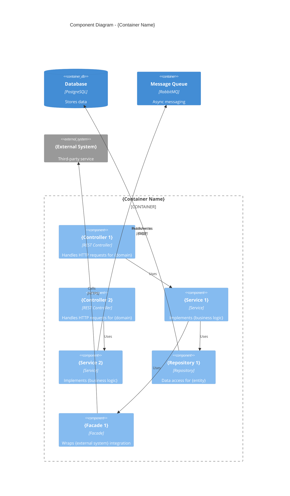

# Component Diagram: {Container Name}

> **System**: {System Name}
> 
> **Container**: {Container Name}
> 
> **Technology**: {Container Technology Stack}
> 
> **Owner**: {Team or person responsible}
> 
> **Last Updated**: {Date}

## Overview

This document describes the internal component architecture of the **{Container Name}** container, showing how functionality is organized into logical groupings.

**Audience**: Software architects, developers.

**Note**: Components are not separately deployable. They all execute within the {Container Name} process space.

## Component Diagram



## Components

### Controllers / Entry Points

| Component | Type | Technology | Responsibility |
|-----------|------|------------|----------------|
| {UserController} | REST Controller | Spring MVC | Handles user CRUD operations |
| {OrderController} | REST Controller | Spring MVC | Handles order management |
| {WebhookHandler} | Event Handler | Custom | Processes incoming webhooks |

### Services / Business Logic

| Component | Type | Technology | Responsibility |
|-----------|------|------------|----------------|
| {UserService} | Service | Spring Service | User management business logic |
| {OrderService} | Service | Spring Service | Order processing and validation |
| {NotificationService} | Service | Spring Service | Sends notifications via various channels |

### Repositories / Data Access

| Component | Type | Technology | Responsibility |
|-----------|------|------------|----------------|
| {UserRepository} | Repository | Spring Data JPA | CRUD operations for User entity |
| {OrderRepository} | Repository | Spring Data JPA | CRUD operations for Order entity |

### Facades / External Integrations

| Component | Type | Technology | Responsibility |
|-----------|------|------------|----------------|
| {PaymentGatewayFacade} | Facade | Custom HTTP Client | Wraps payment provider API |
| {EmailServiceFacade} | Facade | SMTP Client | Wraps email sending operations |

## Component Details

### {Component 1 Name}

**Type**: {Controller | Service | Repository | Facade | etc.}

**Technology**: {e.g., Spring MVC RestController}

**Responsibility**: 
{2-3 sentences describing what this component does}

**Interface**:
```
- GET /users/{id} → User
- POST /users → User
- PUT /users/{id} → User
- DELETE /users/{id} → void
```

**Dependencies**:
- {UserService} - for business logic
- {AuditLogger} - for logging changes

---

### {Component 2 Name}

**Type**: {Type}

**Technology**: {Technology}

**Responsibility**: 
{Description}

**Key Methods**:
```
- createOrder(OrderRequest) → Order
- validateOrder(Order) → ValidationResult
- processPayment(Order, PaymentDetails) → PaymentResult
```

**Dependencies**:
- {OrderRepository} - for persistence
- {PaymentGatewayFacade} - for payment processing
- {InventoryService} - for stock checks

---

## Component Interactions

### Internal Interactions

| From | To | Description | Method |
|------|-----|-------------|--------|
| {UserController} | {UserService} | Delegates user operations | Method call |
| {UserService} | {UserRepository} | Persists user data | Method call |
| {OrderService} | {NotificationService} | Triggers order notifications | Event |

### External Interactions

| Component | External Element | Direction | Description |
|-----------|------------------|-----------|-------------|
| {PaymentGatewayFacade} | Payment Provider | Outbound | Process payments |
| {UserRepository} | User Database | Both | Read/write user data |
| {WebhookHandler} | External Service | Inbound | Receive event notifications |

## Architectural Patterns Used

| Pattern | Implementation | Purpose |
|---------|----------------|---------|
| {Repository Pattern} | {*Repository classes} | Abstract data access |
| {Facade Pattern} | {*Facade classes} | Simplify external integrations |
| {Service Layer} | {*Service classes} | Encapsulate business logic |
| {Dependency Injection} | {Spring IoC} | Loose coupling between components |

## Shared/Cross-Cutting Components

| Component | Used By | Purpose |
|-----------|---------|---------|
| {AuditLogger} | All Controllers | Audit trail logging |
| {ValidationUtils} | All Services | Common validation logic |
| {SecurityContext} | All Components | Access current user/permissions |

## Notes on Component Boundaries

**Grouping Strategy**: {Describe how components were identified - by layer, by feature, by bounded context, etc.}

**Shared Code**: The following utilities are shared across components and not shown as separate components:
- {Helper classes}
- {DTOs/Models}
- {Constants/Enums}

## Related Documentation

- System Context: `../system-context.md`
- Container Diagram: `../system-container.md`
- Other Component Diagrams: `./`
- API Documentation: `../api/{container-name}-api.md`
- Code Repository: `{link to source code}`
