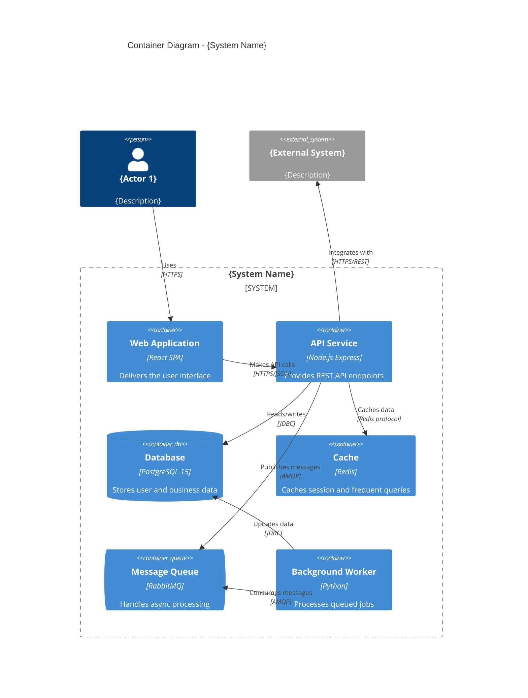

# System Container: {System Name}

> **System**: {System Name from Context Diagram}
> 
> **Purpose**: {Brief system purpose}
> 
> **Owner**: {Team or person responsible}
> 
> **Last Updated**: {Date}

## Overview

This document describes the internal container architecture of {System Name}, showing the high-level technical building blocks and how they interact.

**Audience**: Software architects, developers, operations/support staff.

## Container Diagram

## Containers

### Applications & Services

| Container | Technology | Responsibility |
|-----------|------------|----------------|
| {Web Application} | {React 18, TypeScript} | {Delivers the user interface to browsers} |
| {API Service} | {Node.js 20, Express} | {Handles business logic, exposes REST API} |
| {Background Worker} | {Python 3.11} | {Processes async jobs from queue} |

### Data Stores

| Container | Technology | Responsibility | Data Stored |
|-----------|------------|----------------|-------------|
| {Database} | {PostgreSQL 15} | {Primary data store} | {Users, orders, transactions} |
| {Cache} | {Redis 7} | {Performance optimization} | {Sessions, frequently accessed data} |

### Messaging

| Container | Technology | Responsibility | Message Types |
|-----------|------------|----------------|---------------|
| {Message Queue} | {RabbitMQ 3.12} | {Async communication} | {Email jobs, notifications, reports} |

## Container Details

### {Container 1 Name}

**Type**: {Web Application | API Service | Database | etc.}

**Technology Stack**:
- Runtime: {e.g., Node.js 20}
- Framework: {e.g., Express 4.x}
- Key Libraries: {e.g., Prisma ORM, JWT}

**Responsibility**: 
{2-3 sentences describing what this container does}

**Scaling Notes**:
{How this container can be scaled - horizontal, vertical, constraints}

---

### {Container 2 Name}

**Type**: {Type}

**Technology Stack**:
- Runtime: {Runtime}
- Framework: {Framework}

**Responsibility**: 
{Description}

---

## Communication Patterns

### Synchronous Communication

| From | To | Protocol | Purpose |
|------|-----|----------|---------|
| {Web App} | {API Service} | HTTPS/REST | {User actions} |
| {API Service} | {Database} | JDBC/TCP | {Data persistence} |

### Asynchronous Communication

| From | To | Protocol | Purpose |
|------|-----|----------|---------|
| {API Service} | {Message Queue} | AMQP | {Offload long-running tasks} |
| {Worker} | {Message Queue} | AMQP | {Process queued jobs} |

## Entry Points

| Actor | Entry Container | Protocol | Purpose |
|-------|-----------------|----------|---------|
| {End User} | {Web Application} | HTTPS | {Access system via browser} |
| {Mobile App} | {API Service} | HTTPS/REST | {Mobile client access} |
| {Admin} | {Admin Dashboard} | HTTPS | {System administration} |

## Integration Points

| External System | Container | Direction | Protocol | Purpose |
|-----------------|-----------|-----------|----------|---------|
| {Payment Gateway} | {API Service} | Outbound | HTTPS/REST | {Process payments} |
| {Email Service} | {Worker} | Outbound | SMTP | {Send notifications} |
| {Identity Provider} | {API Service} | Outbound | OAuth 2.0 | {User authentication} |

## Technology Decisions

| Decision | Choice | Rationale |
|----------|--------|-----------|
| {Primary language} | {TypeScript} | {Type safety, developer experience} |
| {Database} | {PostgreSQL} | {ACID compliance, JSON support} |
| {Message broker} | {RabbitMQ} | {Reliable delivery, team expertise} |

## Related Documentation

- System Context: `./system-context.md`
- Component Diagrams: `./components/`
- Deployment Diagram: `./deployment.md`
- API Documentation: `./api/`
