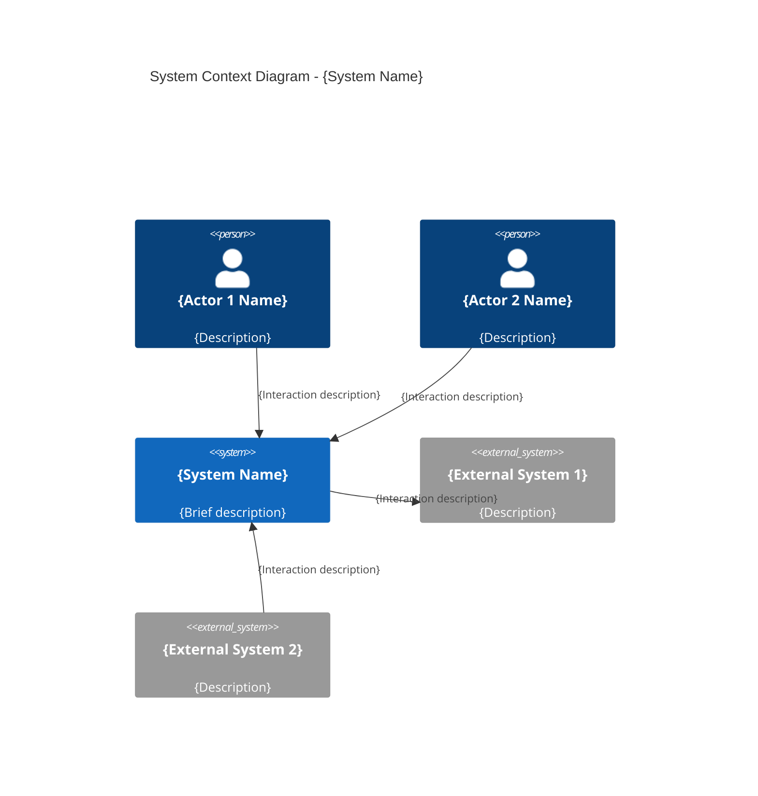

# System Context: {System Name}

> **Purpose**: {Brief 1-2 sentence description of what the system does}
> 
> **Owner**: {Team or person responsible}
> 
> **Last Updated**: {Date}

## System Overview

{2-3 paragraph description of the system, its business value, and why it exists}

## Context Diagram

## People / Actors

| Actor | Description | Interactions |
|-------|-------------|--------------|
| {Actor 1} | {Who they are, their role} | {What they do with the system} |
| {Actor 2} | {Who they are, their role} | {What they do with the system} |

## External Systems

### Internal Dependencies

| System | Owner | Data/Services Consumed | Data/Services Provided |
|--------|-------|------------------------|------------------------|
| {System A} | {Team} | {What we get from it} | {What we send to it} |

### External Dependencies (Third-Party)

| System | Vendor | Data/Services Consumed | Data/Services Provided |
|--------|--------|------------------------|------------------------|
| {System B} | {Vendor} | {What we get from it} | {What we send to it} |

## Key Interactions

| From | To | Description | Frequency |
|------|-----|-------------|-----------|
| {Source} | {Target} | {What happens} | {How often} |

## Boundaries & Scope

**In Scope**:
- {What this system handles}

**Out of Scope**:
- {What is explicitly NOT part of this system}

## Related Documentation

- Container Diagram: `./container.md`
- Component Diagrams: `./components/`
- Deployment Diagram: `./deployment.md`
