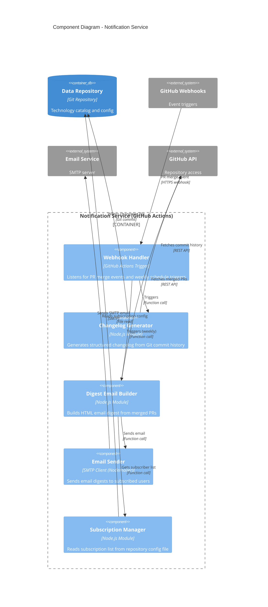

# Component Diagram: Notification Service

> **System**: Tech Registry Portal
>
> **Container**: Notification Service
>
> **Technology**: GitHub Actions (serverless), Node.js, SMTP
>
> **Owner**: Technology Governance Team
>
> **Last Updated**: 2026-01-26

## Overview

This document describes the internal component architecture of the **Notification Service** container, showing how the serverless function is organized to handle change notifications and email digests.

**Audience**: Software architects, developers.

**Note**: Components run within GitHub Actions workflow environment. The service is stateless and event-driven.

## Component Diagram



## Components

### Event Handling

| Component | Type | Technology | Responsibility |
|-----------|------|------------|----------------|
| **Webhook Handler** | Trigger Handler | GitHub Actions Workflow | Listens for two trigger types: (1) PR merge events via GitHub webhooks, (2) Weekly schedule (cron: every Friday morning). Routes events to appropriate handlers based on trigger type. |

### Business Logic

| Component | Type | Technology | Responsibility |
|-----------|------|------------|----------------|
| **Changelog Generator** | Business Logic | Node.js Module | Generates structured changelog from Git commit history. Fetches commits since last changelog update, parses commit messages to extract technology changes, formats changes as markdown with links to PRs, writes changelog file to repository (via Git commit). Triggered on every PR merge. |
| **Digest Email Builder** | Business Logic | Node.js Module | Builds HTML email digest summarizing weekly changes. Fetches all PRs merged in the past 7 days, categorizes changes (new technologies, classification updates, lifecycle transitions, exceptions), formats as HTML email template with summary and detail sections. Triggered weekly via scheduled workflow. |
| **Subscription Manager** | Business Logic | Node.js Module | Manages email subscription list. Reads subscription configuration file from repository (`config/subscribers.json`), validates email addresses, provides list of active subscribers for digest distribution. |

### External Integration

| Component | Type | Technology | Responsibility |
|-----------|------|------------|----------------|
| **Email Sender** | Facade | Nodemailer (SMTP Client) | Wraps email sending operations. Connects to organization SMTP server or external email service (SendGrid, Mailgun), sends HTML email with attachments if needed, handles SMTP authentication, retries on transient failures, logs delivery status. |

## Component Details

### Webhook Handler

**Type**: Trigger Handler

**Technology**: GitHub Actions workflow YAML + shell script

**Responsibility**:

The Webhook Handler is the entry point for the Notification Service, triggered by two event types: (1) PR merge events via GitHub webhooks (`pull_request: types: [closed]` with `merged: true` condition), (2) Weekly schedule via cron expression (`0 9 * * 5` = Fridays at 9 AM UTC). The handler inspects the trigger type and routes execution to the appropriate component: PR merge events trigger Changelog Generator immediately, weekly schedule triggers Digest Email Builder if any PRs were merged in the past 7 days.

**Workflow Configuration** (`/.github/workflows/notifications.yml`):
```yaml
on:
  pull_request:
    types: [closed]
    branches: [main]
  schedule:
    - cron: '0 9 * * 5'  # Fridays at 9 AM UTC

jobs:
  notify:
    runs-on: ubuntu-latest
    steps:
      - name: Checkout
      - name: Setup Node.js
      - name: Install dependencies
      - name: Handle PR merge (if PR merged)
      - name: Handle weekly digest (if scheduled)
```

**Dependencies**:
- Changelog Generator (on PR merge)
- Digest Email Builder (on weekly schedule)

---

### Changelog Generator

**Type**: Business Logic Module

**Technology**: Node.js, Octokit (GitHub API client), Gray-matter (frontmatter parser)

**Responsibility**:

The Changelog Generator creates a structured changelog file from Git commit history whenever a PR is merged. It fetches commits since the last changelog update (stored in changelog file frontmatter), parses commit messages to extract technology changes (new technologies, updates, deprecations), formats changes as markdown with links to PRs and authors, includes metadata (date, PR number, approver), and writes the updated changelog file to the repository via a Git commit. The changelog is displayed on the portal landing page for in-portal discovery.

**Changelog File Format** (`/CHANGELOG.md`):
```markdown
---
lastUpdate: 2026-01-26T10:00:00Z
---

# Technology Governance Changelog

## 2026-01-26

### New Technologies
- [MongoDB Atlas](./technologies/mongodb-atlas.json) - Approved for cloud database use cases (PR #123, @johndoe)

### Classification Changes
- [PostgreSQL](./technologies/postgresql.json) - Lifecycle updated: active → deprecating (PR #124, @janedoe)

### Exceptions Granted
- [Legacy Oracle DB](./technologies/oracle-db.json) - Exception for Project X until 2027-12-31 (PR #125, @director)
```

**Key Functions**:
```typescript
- fetchCommitsSince(lastUpdate) → Commit[]
- parseCommitForChanges(commit) → Change[]
- formatChangelogEntry(changes) → Markdown string
- writeChangelogFile(content) → Git commit
```

**Dependencies**:
- GitHub API (fetch commit history)
- Data Repository (write changelog file)

---

### Digest Email Builder

**Type**: Business Logic Module

**Technology**: Node.js, Handlebars (HTML templating), Octokit (GitHub API client)

**Responsibility**:

The Digest Email Builder creates weekly email digests summarizing technology governance changes. Triggered every Friday morning by scheduled workflow, it checks if any PRs were merged in the past 7 days. If no changes, the workflow exits early (no email sent). If changes exist, it fetches all merged PRs, categorizes them by change type (new technologies, classification updates, lifecycle transitions, exceptions), retrieves technology details for each change, formats the digest as HTML email using Handlebars template, and passes the email to Email Sender for distribution. Includes unsubscribe link in email footer.

**Email Template Structure**:
```html
<h1>Tech Registry Weekly Digest</h1>
<p>Summary: X new technologies, Y updates, Z exceptions this week</p>

<h2>New Technologies</h2>
<ul>
  <li>MongoDB Atlas - Approved for cloud database use cases (<a href="PR link">View proposal</a>)</li>
</ul>

<h2>Classification Changes</h2>
<ul>
  <li>PostgreSQL: active → deprecating (<a href="PR link">Details</a>)</li>
</ul>

<footer>
  <a href="unsubscribe link">Unsubscribe</a> | View full changelog in portal
</footer>
```

**Key Functions**:
```typescript
- fetchMergedPRs(sinceDate) → PR[]
- categorizePRs(prs) → CategorizedChanges
- buildEmailHTML(changes) → HTML string
- checkIfChangesExist() → boolean (early exit if no changes)
```

**Dependencies**:
- GitHub API (fetch merged PRs)
- Subscription Manager (get subscriber list)
- Email Sender (send email)

---

### Subscription Manager

**Type**: Business Logic Module

**Technology**: Node.js, JSON parser

**Responsibility**:

The Subscription Manager maintains the list of users subscribed to weekly email digests. Reads subscription configuration file from the repository (`config/subscribers.json`), validates email addresses (basic format validation), filters active subscriptions (ignores unsubscribed users), provides list to Digest Email Builder for distribution. Subscription management (add/remove subscribers) is handled manually by administrators editing the config file via PR.

**Subscription Config Format** (`/config/subscribers.json`):
```json
{
  "subscribers": [
    {
      "email": "john.doe@company.com",
      "name": "John Doe",
      "subscribed": true,
      "subscribedAt": "2026-01-15T10:00:00Z"
    },
    {
      "email": "jane.smith@company.com",
      "name": "Jane Smith",
      "subscribed": false,
      "unsubscribedAt": "2026-01-20T12:00:00Z"
    }
  ]
}
```

**Key Functions**:
```typescript
- readSubscriptionConfig() → Subscription[]
- getActiveSubscribers() → string[] (email addresses)
- validateEmailAddress(email) → boolean
```

**Dependencies**:
- Data Repository (read subscription config file)

---

### Email Sender

**Type**: Facade

**Technology**: Nodemailer (Node.js SMTP client)

**Responsibility**:

The Email Sender wraps SMTP operations for sending digest emails. Connects to organization SMTP server (or external email service like SendGrid, Mailgun) using credentials from GitHub Actions secrets, constructs email message with HTML body and plain-text fallback, sends email to subscriber list (batch sending for large lists to avoid rate limits), handles SMTP authentication and TLS/SSL encryption, implements retry logic for transient failures (network issues, server timeouts), logs delivery status for monitoring and troubleshooting.

**SMTP Configuration** (from GitHub Actions secrets):
```
SMTP_HOST=smtp.company.com
SMTP_PORT=587
SMTP_USER=noreply@company.com
SMTP_PASSWORD=<secret>
```

**Key Functions**:
```typescript
- sendEmail(to, subject, html, text) → DeliveryResult
- batchSendEmails(recipients, subject, html, text) → DeliveryResult[]
- retryOnFailure(operation, maxRetries) → Result
```

**Delivery Status Logging**:
- Success: Log recipient count, delivery timestamp
- Failure: Log error details, failed recipients, retry attempts

**Dependencies**:
- Email Service (external SMTP server)

---

## Component Interactions

### Internal Interactions

| From | To | Description | Method |
|------|-----|-------------|--------|
| **Webhook Handler** | **Changelog Generator** | Triggers changelog update on PR merge | Function call (Node.js module) |
| **Webhook Handler** | **Digest Email Builder** | Triggers weekly digest on schedule | Function call (Node.js module) |
| **Changelog Generator** | **GitHub API** | Fetches commit history since last update | Octokit REST API calls |
| **Digest Email Builder** | **GitHub API** | Fetches merged PRs from past 7 days | Octokit REST API calls |
| **Digest Email Builder** | **Subscription Manager** | Retrieves active subscriber list | Function call (Node.js module) |
| **Digest Email Builder** | **Email Sender** | Sends constructed email digest | Function call (Node.js module) |
| **Subscription Manager** | **Data Repository** | Reads subscription config file | File read via Octokit |

### External Interactions

| Component | External Element | Direction | Description | Protocol |
|-----------|------------------|-----------|-------------|----------|
| **Webhook Handler** | **GitHub Webhooks** | Inbound | Receives PR merge event notifications | HTTPS webhook |
| **Changelog Generator** | **GitHub API** | Outbound | Fetches commit history, writes changelog file | REST API / HTTPS |
| **Changelog Generator** | **Data Repository** | Outbound | Commits updated changelog to repository | Git commit via GitHub API |
| **Digest Email Builder** | **GitHub API** | Outbound | Fetches merged PRs and details | REST API / HTTPS |
| **Subscription Manager** | **Data Repository** | Outbound | Reads subscription configuration | File read via GitHub API |
| **Email Sender** | **Email Service** | Outbound | Sends SMTP emails to subscribers | SMTP (port 587 with TLS) |

## Architectural Patterns Used

| Pattern | Implementation | Purpose |
|---------|----------------|---------|
| **Event-Driven Architecture** | GitHub webhooks and scheduled triggers drive execution | React to events (PR merges) and time-based schedules without continuous polling |
| **Facade Pattern** | Email Sender wraps SMTP complexity | Simplify email operations, isolate external SMTP dependency |
| **Separation of Concerns** | Distinct components for changelog, digest, subscriptions | Each component has single responsibility, easier to test and maintain |
| **Stateless Serverless** | No persistent state between invocations | Scales automatically, no server management, cost-efficient (pay per execution) |

## Configuration & Secrets

### GitHub Actions Secrets

Sensitive configuration stored as GitHub repository secrets:

```
SMTP_HOST=smtp.company.com
SMTP_PORT=587
SMTP_USER=noreply@company.com
SMTP_PASSWORD=<secret password>
SMTP_FROM_ADDRESS=tech-registry@company.com
SMTP_FROM_NAME=Tech Registry Portal
```

### Repository Configuration Files

Non-sensitive configuration stored in repository:

- `/config/subscribers.json` - Email subscription list (manually managed via PR)
- `/config/notification-settings.json` - Email template settings, unsubscribe URL, digest schedule

## Error Handling & Monitoring

### Error Scenarios

| Scenario | Handling | Recovery |
|----------|----------|----------|
| **GitHub API failure** | Retry 3 times with exponential backoff | Log error, workflow fails, alerts sent to admin |
| **SMTP connection failure** | Retry 5 times with exponential backoff | Log error, workflow fails, email not sent (retry on next run) |
| **Invalid subscription config** | Validate on read, log warnings, skip invalid entries | Continue with valid subscribers, alert admin to fix config |
| **Empty PR list (no changes)** | Early exit from workflow | No email sent, workflow succeeds silently |

### Monitoring & Alerting

**GitHub Actions Workflow Status**:
- Success: Changelog updated, email sent (if weekly digest)
- Failure: Workflow run fails, GitHub sends notification to repository admins

**Logging**:
- Log all workflow executions with timestamps
- Log PR merge events and changelog updates
- Log email delivery status (success, failures, retry attempts)
- Log subscriber count for each digest sent

**Alerting**:
- GitHub Actions failure notification to repository admins
- Email delivery failures logged for manual investigation

## Performance Considerations

### Execution Time

**PR Merge Trigger**:
- Changelog generation: <30 seconds (fetch commits, parse, write file)
- Workflow execution within 1 minute of PR merge

**Weekly Digest**:
- Digest building: 1-2 minutes (fetch PRs, categorize, build email, send)
- Execution time scales with number of subscribers (batch sending)

**GitHub Actions Limits**:
- Workflow execution limit: 6 hours (far exceeds notification service needs)
- No performance concerns with current architecture

### Scalability

**Subscriber Count**:
- Current approach: Send individual emails to each subscriber
- Scalability limit: ~1000 subscribers (batch sending, SMTP rate limits)
- If exceeding 1000 subscribers, consider email service provider (SendGrid, Mailgun) with batch API

**Frequency**:
- Current: Weekly digest (low frequency)
- If increasing to daily, consider rate limits and cost implications

## Testing Strategy

### Unit Testing

**Tools**: Jest (Node.js test runner)

**Test Coverage**:
- **Changelog Generator**: Test commit parsing, markdown formatting, file writing (mock GitHub API)
- **Digest Email Builder**: Test PR categorization, HTML generation (mock data)
- **Subscription Manager**: Test config parsing, email validation (no mocks needed)
- **Email Sender**: Test SMTP operations, retry logic (mock Nodemailer)

### Integration Testing

**Tools**: Jest with GitHub API mocking (Nock library)

**Test Coverage**:
- **End-to-End Workflow**: Simulate PR merge event, verify changelog updated
- **Weekly Digest Flow**: Simulate scheduled trigger, verify email sent
- **Error Scenarios**: Test API failures, SMTP failures, config errors

### Manual Testing

**Pre-Production Testing**:
- Trigger workflow manually via GitHub Actions UI (`workflow_dispatch` event)
- Test with small subscriber list (team members only)
- Verify email formatting, links, unsubscribe functionality

## Deployment & Configuration

### Deployment Process

**GitHub Actions Workflow File**: `/.github/workflows/notifications.yml`

**Deployment Steps**:
1. Commit workflow file and Node.js modules to repository
2. Configure GitHub Actions secrets (SMTP credentials)
3. Commit subscription config file (`/config/subscribers.json`)
4. Push to `main` branch
5. Workflow automatically triggers on PR merge or weekly schedule

**No Separate Deployment**: Serverless function deployed automatically when workflow file is pushed to repository.

### Configuration Changes

**SMTP Settings**:
- Update GitHub Actions secrets via repository settings
- No code changes required, workflow picks up new secrets on next run

**Subscription List**:
- Edit `/config/subscribers.json` via PR
- Changes take effect on next digest run

**Email Template**:
- Edit Handlebars template in Node.js module
- Commit and push changes
- Next digest uses updated template

## Future Enhancements

### Potential Improvements

1. **Subscription Management UI**: Allow users to subscribe/unsubscribe via portal interface (currently manual via config file)
2. **Notification Preferences**: Per-user settings for notification frequency (daily, weekly, monthly) or content filters (only greenbook changes, only deprecations)
3. **Slack Integration**: Post changelog summaries to Slack channels in addition to email
4. **Immediate Notifications**: Send email immediately on critical changes (e.g., technology moved to blackbook) instead of waiting for weekly digest
5. **Email Analytics**: Track open rates, click-through rates to measure engagement

### Scalability Enhancements

1. **Database for Subscriptions**: Move from JSON config file to database for easier management at scale
2. **Email Service Provider API**: Use SendGrid/Mailgun API for better deliverability and analytics at scale (beyond 1000 subscribers)
3. **Personalized Digests**: Tailor digest content based on user role, team, or technology interests

## Related Documentation

- System Context: `../system-context.md`
- Container Diagram: `../system-container.md`
- Web Application Component Diagram: `./web-application.md`
- Deployment Diagram: `../system-deployment.md` (to be created)
- GitHub Actions Documentation: https://docs.github.com/en/actions
