# Component Diagram: Web Application (SPA)

> **System**: Tech Registry Portal
>
> **Container**: Web Application (SPA)
>
> **Technology**: Vue.js 3, TypeScript, Vite, Pinia, VueQuery, Vue Router
>
> **Owner**: Technology Governance Team
>
> **Last Updated**: 2026-01-26

## Overview

This document describes the internal component architecture of the **Web Application (SPA)** container, showing how functionality is organized into logical groupings within the Vue.js single-page application.

**Audience**: Software architects, developers.

**Note**: Components are not separately deployable. They all execute within the Web Application browser process space as JavaScript modules.

## Component Diagram

```mermaid
C4Component
    title Component Diagram - Web Application (SPA)

    Container_Boundary(spa, "Web Application (SPA)") {
        Component(router, "Router", "Vue Router v4", "Manages client-side routing and navigation between pages")

        Component(tech_catalog, "Technology Catalog Module", "Vue Components + Composables", "Technology discovery, search, filtering, and detail views")
        Component(proposal_mgmt, "Proposal Management Module", "Vue Components + Composables", "Proposal submission forms, PR creation, review interface")
        Component(admin_panel, "Administration Panel Module", "Vue Components + Composables", "Bulk operations, revalidation tracking, exception management")
        Component(analytics_dashboard, "Analytics Dashboard Module", "Vue Components + Composables", "Adoption metrics, search analytics, engagement reports")
        Component(auth_module, "Authentication Module", "Pinia Store + Composables", "OAuth flow, token management, permission checks")

        Component(github_client, "GitHub API Client", "Octokit (TypeScript)", "Wraps GitHub REST and GraphQL API calls")
        Component(schema_validator, "Schema Validator", "Ajv + Generated Types", "Validates technology records against JSON Schema, provides TypeScript types")
        Component(matomo_client, "Analytics Client", "Matomo Tracker", "Sends analytics events to Matomo")
        Component(state_manager, "State Manager", "Pinia + VueQuery", "Manages UI state and server state caching")
        Component(search_engine, "Search Engine", "Custom Module", "Client-side search and filtering for loaded data")
    }

    ContainerDb(data_repo, "Data Repository", "Git Repository (JSON + Schemas)", "Technology catalog and JSON Schemas")
    System_Ext(github_api, "GitHub API", "Backend services")
    System_Ext(github_oauth, "GitHub OAuth", "Authentication")
    System_Ext(matomo, "Matomo Analytics", "Analytics platform")
    System_Ext(leanix, "LeanIX", "EA management")

    Rel(router, tech_catalog, "Routes to", "Component rendering")
    Rel(router, proposal_mgmt, "Routes to", "Component rendering")
    Rel(router, admin_panel, "Routes to", "Component rendering")
    Rel(router, analytics_dashboard, "Routes to", "Component rendering")

    Rel(tech_catalog, github_client, "Fetches technologies", "API calls")
    Rel(tech_catalog, schema_validator, "Validates technology data", "Function calls")
    Rel(tech_catalog, search_engine, "Searches/filters", "Function calls")
    Rel(tech_catalog, state_manager, "Caches data", "Pinia stores + VueQuery")
    Rel(tech_catalog, leanix, "Deep links", "External URLs")

    Rel(proposal_mgmt, github_client, "Creates PRs, fetches proposal status", "API calls")
    Rel(proposal_mgmt, schema_validator, "Validates proposal data before submission", "Function calls")
    Rel(proposal_mgmt, state_manager, "Caches proposals", "VueQuery composables")
    Rel(proposal_mgmt, auth_module, "Checks permissions", "Pinia store access")

    Rel(admin_panel, github_client, "Bulk operations via GraphQL, fetches Issues", "API calls")
    Rel(admin_panel, schema_validator, "Validates bulk update data", "Function calls")
    Rel(admin_panel, state_manager, "Caches admin data", "VueQuery composables")
    Rel(admin_panel, auth_module, "Validates admin role", "Pinia store access")

    Rel(analytics_dashboard, github_client, "Fetches traffic stats", "API calls")
    Rel(analytics_dashboard, matomo_client, "Fetches Matomo data", "API calls")
    Rel(analytics_dashboard, state_manager, "Caches metrics", "VueQuery composables")

    Rel(auth_module, github_oauth, "OAuth PKCE flow", "OAuth 2.0")
    Rel(auth_module, github_client, "Provides auth token", "Token injection")
    Rel(auth_module, state_manager, "Stores token in memory", "Pinia store")

    Rel(github_client, github_api, "REST + GraphQL requests", "HTTPS")
    Rel(github_client, data_repo, "Reads/writes data", "Via GitHub API")

    Rel(schema_validator, data_repo, "Fetches JSON Schema definitions", "Via GitHub API")

    Rel(matomo_client, matomo, "Sends events", "HTTPS")

    Rel(tech_catalog, matomo_client, "Tracks page views", "Event calls")
    Rel(proposal_mgmt, matomo_client, "Tracks proposals", "Event calls")
    Rel(admin_panel, matomo_client, "Tracks admin actions", "Event calls")
```



## Components

### Page Modules / Feature Components

| Component | Type | Technology | Responsibility |
|-----------|------|------------|----------------|
| **Technology Catalog Module** | Feature Module | Vue 3 Components, TypeScript, VueQuery Composables | Provides technology discovery interface with paginated browsing, search with filters (classification, lifecycle, category), technology detail views with lifecycle indicators and exception information, changelog display. Validates all technology data against JSON Schema before rendering. |
| **Proposal Management Module** | Feature Module | Vue 3 Components, TypeScript, VeeValidate Forms | Enables proposal submission through web forms with JSON Schema validation, displays proposal status and list, provides proposal review interface for administrators with business-friendly diff visualization, triggers PR creation and merge via GitHub API. Validates proposal data against schema before submission. |
| **Administration Panel Module** | Feature Module | Vue 3 Components, TypeScript | Provides administrative dashboards for reviewing pending proposals, bulk operation UI for updating multiple technologies (via GraphQL multi-file commits with schema validation), revalidation tracking interface (displays GitHub Issues linked to technologies), exception management forms. |
| **Analytics Dashboard Module** | Feature Module | Vue 3 Components, Chart.js/Apache ECharts | Displays adoption metrics from hybrid sources (Matomo + GitHub API stats), search analytics and most-viewed technologies, proposal activity metrics, engagement trend visualization. |
| **Router** | Routing | Vue Router v4 | Manages client-side routing between pages, handles navigation state, provides route guards for authenticated/admin routes using composables, enables deep linking to specific technologies or proposals. |

### Core Infrastructure Components

| Component | Type | Technology | Responsibility |
|-----------|------|------------|----------------|
| **Authentication Module** | Infrastructure | Pinia Store, Vue Composables | Implements GitHub OAuth PKCE flow, stores OAuth tokens in Pinia store (memory only), provides authentication status to components via composables, validates user permissions from GitHub repository access, enforces CSP and security policies. |
| **GitHub API Client** | Facade | Octokit (GitHub REST + GraphQL client) | Wraps all GitHub API interactions, provides typed methods for fetching technologies, creating PRs (portal-mediated proposals), performing bulk operations via GraphQL, fetching GitHub Issues for revalidation, retrieving traffic stats for analytics, fetching JSON Schema definitions. |
| **Schema Validator** | Utility | Ajv + json-schema-to-typescript | Validates technology records against JSON Schema at runtime using Ajv (fastest JSON Schema validator). Generates TypeScript interfaces from JSON Schema definitions for compile-time type safety. Provides validation functions used throughout the application. Ensures data integrity before rendering and before submission. |
| **Analytics Client** | Facade | Matomo JavaScript Tracker | Wraps Matomo analytics API, sends page view events, tracks user interactions and search queries, provides composable functions for custom event tracking, handles privacy-compliant tracking. |
| **State Manager** | Infrastructure | Pinia (UI state) + VueQuery (server state) | Manages UI state with Pinia stores (authentication, theme, notifications). Handles server state with VueQuery composables providing caching and invalidation for GitHub API data. Manages loading and error states. Provides optimistic updates for mutations. |
| **Search Engine** | Utility | Custom TypeScript Module | Performs client-side search and filtering on loaded technology data, implements fuzzy text search across technology names and descriptions, provides filter combinators (AND logic for multiple filters), ranks search results by relevance. |

## Component Details

### Technology Catalog Module

**Type**: Feature Module

**Technology**: Vue 3 Composition API with TypeScript, VueQuery for data fetching, Ajv for validation

**Responsibility**:

The Technology Catalog Module is the primary user-facing interface for discovering and exploring technologies in the governance catalog. It provides paginated browsing of technologies with advanced filtering capabilities (by classification, lifecycle stage, category, ownership). Users can perform full-text search across technology names and descriptions. Technology detail pages display comprehensive information including lifecycle indicators, approval dates, exception details, version history, and links to LeanIX for enterprise architecture context. The module also displays a changelog of recent technology changes on the portal landing page. **All technology data is validated against JSON Schema before rendering to ensure data integrity.**

**Key Vue Components**:
- `TechnologyListPage.vue` - Paginated technology browser with filters
- `TechnologyDetailPage.vue` - Detailed technology view with all metadata
- `TechnologySearchBar.vue` - Search input with autocomplete
- `FilterPanel.vue` - Filter UI (classification, lifecycle, category)
- `ChangelogWidget.vue` - Recent changes display on landing page

**Key Composables**:
- `useTechnologies()` - VueQuery composable for data fetching and pagination with schema validation
- `useTechnologyDetail()` - VueQuery composable for single technology fetch with validation
- `useTechnologyFilters()` - Reactive filter state management

**Interface (Routes)**:
```
/technologies - Technology list with filters
/technologies/:id - Technology detail page
/technologies/search?q={query} - Search results
/ - Landing page with changelog
```

**Dependencies**:
- GitHub API Client - fetch technology catalog
- Schema Validator - validate technology records against JSON Schema
- Search Engine - client-side search/filter
- State Manager - cache technology data (Pinia + VueQuery)
- Analytics Client - track page views
- Router - navigation

---

### Proposal Management Module

**Type**: Feature Module

**Technology**: Vue 3 Composition API with TypeScript, VeeValidate for form validation, VueQuery for mutations

**Responsibility**:

The Proposal Management Module enables portal-mediated proposal submission and review. Users submit proposals for new technologies or changes to existing records through validated web forms. **All proposal data is validated against JSON Schema before submission to prevent invalid data from reaching the repository.** The module creates Pull Requests automatically via GitHub API on behalf of users, eliminating the need for direct GitHub interaction. Administrators review proposals in a business-friendly format (not raw Git diffs) with visual diff highlighting. The module displays proposal status (draft, submitted, under review, approved, rejected) and enables approval actions that trigger PR merges via GitHub API. All proposal activity is tracked for governance audit.

**Key Vue Components**:
- `ProposalListPage.vue` - View all proposals with status filters
- `ProposalSubmissionForm.vue` - Form for new technology proposals with schema-based validation
- `ProposalEditForm.vue` - Form for changes to existing technologies
- `ProposalReviewPage.vue` - Admin interface for reviewing proposals
- `ProposalDiffViewer.vue` - Visual diff display (business-friendly)

**Key Composables**:
- `useCreateProposal()` - VueQuery mutation for PR creation with schema validation
- `useProposals()` - VueQuery composable to fetch proposals (PRs from GitHub)
- `useApproveProposal()` - VueQuery mutation for PR merge
- `useProposalValidation()` - Schema validation composable for forms

**Interface (Routes)**:
```
/proposals - List all proposals
/proposals/new - Submit new technology proposal
/proposals/:id - View/review proposal detail
/proposals/:id/edit - Edit draft proposal
```

**Key Composables**:
```typescript
// useTechnologies composable
const {
  data: technologies,
  isLoading,
  error,
  refetch
} = useTechnologies(filters, pagination)

// useCreateProposal composable
const { mutate: createProposal, isLoading } = useCreateProposal()
await createProposal(proposalData) // Validates against schema, creates PR

// useApproveProposal composable
const { mutate: approveProposal } = useApproveProposal()
await approveProposal(prNumber) // Merge PR, update catalog

// useProposalValidation composable
const { validate, errors } = useProposalValidation(schema)
const isValid = await validate(proposalData)
```

**Dependencies**:
- GitHub API Client - create/merge PRs, fetch PR status
- Schema Validator - validate proposal data against JSON Schema
- Authentication Module - check user permissions (Pinia store)
- State Manager - cache proposals and mutations (VueQuery)
- Analytics Client - track proposal submissions

---

### Administration Panel Module

**Type**: Feature Module

**Technology**: Vue 3 Composition API with TypeScript, VueQuery for complex mutations

**Responsibility**:

The Administration Panel Module provides governance administrators with tools for efficient catalog management. It offers dashboards for reviewing pending proposals with visual diffs and approval workflows. Bulk operation interface allows administrators to select multiple technologies and apply changes in a single multi-file commit via GitHub GraphQL API (e.g., mark 50 technologies as requiring revalidation). **All bulk update data is validated against JSON Schema before submission to ensure data integrity.** The revalidation tracking interface displays GitHub Issues linked to technologies that require revalidation, showing assignees, status, and progress. Exception management forms enable creation and tracking of exceptions with director-level approval workflows.

**Key Vue Components**:
- `AdminDashboard.vue` - Overview of pending proposals and revalidations
- `BulkOperationsPage.vue` - Multi-select and bulk update interface with schema validation
- `RevalidationTrackingPage.vue` - Display GitHub Issues for revalidation
- `ExceptionManagementPage.vue` - Create and track exceptions

**Key Composables**:
- `useBulkUpdate()` - VueQuery mutation for GraphQL multi-file commit with validation
- `useRevalidationIssues()` - VueQuery composable to fetch GitHub Issues
- `useCreateException()` - VueQuery mutation to add exception to technology
- `useBulkValidation()` - Schema validation for bulk operations

**Interface (Routes)**:
```
/admin - Admin dashboard
/admin/bulk - Bulk operations interface
/admin/revalidation - Revalidation tracking
/admin/exceptions - Exception management
```

**Key Composables**:
```typescript
// useBulkUpdate composable
const { mutate: bulkUpdate, isLoading } = useBulkUpdate()
await bulkUpdate({ techIds, updates }) // Validates all updates, creates GraphQL commit

// useRevalidationIssues composable
const { data: issues } = useRevalidationIssues()

// useCreateException composable
const { mutate: createException } = useCreateException()
await createException({ techId, exceptionData })
```

**Dependencies**:
- GitHub API Client - GraphQL bulk operations, GitHub Issues
- Schema Validator - validate bulk update data
- Authentication Module - validate admin role (Pinia store)
- State Manager - cache admin data (VueQuery)
- Analytics Client - track admin actions

---

### Analytics Dashboard Module

**Type**: Feature Module

**Technology**: Vue 3 Composition API with TypeScript, Chart.js or Apache ECharts for visualization

**Responsibility**:

The Analytics Dashboard Module provides IT leaders and administrators with insights into portal adoption and technology governance engagement. It displays adoption metrics from hybrid data sources: Matomo provides page views, searches, and user engagement; GitHub API provides traffic stats including unique contributors and PR activity. The dashboard visualizes trends over time, shows most-viewed and most-searched technologies, tracks proposal activity metrics (submissions, approvals, rejections), and calculates progress toward adoption goals (10% at 6 months, 30% at 1 year).

**Key Vue Components**:
- `AnalyticsDashboard.vue` - Overview of all metrics
- `AdoptionMetricsWidget.vue` - User adoption trends chart
- `TechnologyPopularityWidget.vue` - Most viewed/searched technologies
- `ProposalActivityWidget.vue` - Proposal submission and approval metrics

**Key Composables**:
- `useAdoptionMetrics()` - VueQuery composable to fetch Matomo + GitHub stats
- `useTechnologyPopularity()` - Aggregate view counts from analytics

**Interface (Routes)**:
```
/analytics - Analytics dashboard (admin/leader only)
/analytics/adoption - Detailed adoption metrics
/analytics/technologies - Technology popularity trends
```

**Dependencies**:
- GitHub API Client - fetch traffic stats
- Analytics Client - fetch Matomo data
- State Manager - cache metrics with TTL (VueQuery)
- Authentication Module - restrict to admin/leader roles (Pinia store)

---

### Authentication Module

**Type**: Infrastructure Component

**Technology**: Pinia Store, Vue Composables, GitHub OAuth PKCE

**Responsibility**:

The Authentication Module manages user authentication and authorization throughout the application. It implements GitHub OAuth with PKCE (Proof Key for Code Exchange) flow for secure authentication without client secrets. OAuth tokens are stored exclusively in Pinia store (memory only) for XSS protection, requiring re-authentication on page refresh. The module provides authentication status to all components via composables, validates user permissions by checking GitHub repository access (read/write/merge), and enforces role-based access control (regular users can submit proposals, admins can approve, directors can approve exceptions). Implements strict Content Security Policy (CSP) for defense in depth.

**Pinia Store** (`useAuthStore`):
```typescript
export const useAuthStore = defineStore('auth', () => {
  const token = ref<string | null>(null) // Memory only
  const user = ref<User | null>(null)
  const permissions = ref<Permissions | null>(null)

  const isAuthenticated = computed(() => !!token.value)
  const hasAdminRole = computed(() => permissions.value?.canMerge ?? false)

  async function login() { /* OAuth PKCE flow */ }
  function logout() { /* Clear token from memory */ }
  async function checkPermissions() { /* Fetch from GitHub API */ }

  return { token, user, permissions, isAuthenticated, hasAdminRole, login, logout }
})
```

**Composables**:
- `useAuth()` - Access authentication state from Pinia store
- `useGitHubOAuth()` - OAuth PKCE flow implementation
- `useRequireAuth()` - Route guard composable for authenticated pages
- `useRequireAdmin()` - Route guard composable for admin-only pages

**Interface (Composables)**:
```typescript
const {
  user,
  isAuthenticated,
  hasAdminRole,
  login,
  logout
} = useAuth()

// Route guards in Router setup
router.beforeEach((to) => {
  if (to.meta.requiresAuth && !useAuth().isAuthenticated) {
    return '/login'
  }
})
```

**Key Functions**:
```typescript
- initiateOAuthFlow() → Redirect to GitHub with PKCE challenge
- handleOAuthCallback(code) → Exchange code for token
- storeTokenInMemory(token) → Store in Pinia store (memory)
- fetchUserPermissions() → Get repo access from GitHub API
- checkAdminRole(user) → Validate merge permissions
```

**Dependencies**:
- GitHub OAuth - authentication service
- GitHub API Client - fetch user permissions
- State Manager - Pinia store for token (memory)

---

### GitHub API Client

**Type**: Facade

**Technology**: Octokit (Official GitHub API client for JavaScript/TypeScript)

**Responsibility**:

The GitHub API Client wraps all interactions with GitHub's REST and GraphQL APIs, providing a typed, consistent interface to the rest of the application. It handles authentication token injection, request/response transformation, error handling, and rate limit management. The client provides methods for fetching technology catalog data (paginated), fetching JSON Schema definitions, creating Pull Requests for portal-mediated proposals, performing bulk operations via GraphQL multi-file commits, fetching GitHub Issues for revalidation tracking, retrieving commit history for changelog generation, and fetching repository traffic stats for analytics.

**Key Modules**:
- `TechnologyDataAPI` - Technology catalog operations
- `SchemaAPI` - Fetch JSON Schema definitions
- `ProposalAPI` - PR creation and management
- `BulkOperationsAPI` - GraphQL multi-file commits
- `RevalidationAPI` - GitHub Issues integration
- `AnalyticsAPI` - Traffic stats retrieval

**Interface (Key Methods)**:
```typescript
// Technology Catalog
- getTechnologies(filters, pagination) → Technology[] (validated against schema)
- getTechnology(id) → Technology (validated)
- searchTechnologies(query) → Technology[]

// JSON Schema
- getSchema(schemaName) → JSONSchema (e.g., 'technology.v1.schema.json')
- listSchemas() → string[] (all available schemas)

// Proposals (Portal-Mediated PRs)
- createProposal(proposalData) → Create PR, return PR number
- getProposals(status) → PR[] (filtered by status)
- getProposalDetail(prNumber) → PR with diff
- approveProposal(prNumber) → Merge PR
- rejectProposal(prNumber, reason) → Close PR with comment

// Bulk Operations (GraphQL)
- bulkUpdateTechnologies(updates) → Multi-file commit with validation
- createCommitWithMultipleFiles(files) → GraphQL mutation

// Revalidation (GitHub Issues)
- createRevalidationIssue(techId, assignee) → Issue
- getRevalidationIssues(filters) → Issue[]
- updateIssueStatus(issueId, status) → Issue

// Changelog
- getCommitHistory(since, until) → Commit[]

// Analytics
- getRepositoryTraffic() → Traffic stats (views, clones, unique visitors)
```

**Dependencies**:
- GitHub API (external) - backend services
- Data Repository (external) - Git repository with technology data and schemas
- Authentication Module - OAuth token for requests (Pinia store)

---

### Schema Validator

**Type**: Utility Component

**Technology**: Ajv (JSON Schema validator), json-schema-to-typescript (type generator)

**Responsibility**:

The Schema Validator is a critical component ensuring **type safety and data integrity** throughout the application. It validates all technology records against JSON Schema specifications at runtime using Ajv (fastest JSON Schema validator). The validator generates TypeScript interfaces from JSON Schema definitions using json-schema-to-typescript, providing compile-time type checking in addition to runtime validation. This ensures that technology data is technically valid before rendering in the UI and before submission to the repository. The validator fetches schema definitions from the Data Repository via GitHub API and caches them for performance.

**Schema Validation Flow**:
```
1. Application starts → Fetch schemas from repository
2. User loads technology → Validate against technology.v1.schema.json
3. User submits proposal → Validate against schema before PR creation
4. Admin bulk updates → Validate all updates against schema before commit
5. TypeScript compiler → Uses generated types for compile-time checks
```

**Key Functions**:
```typescript
// Runtime validation
- validateTechnology(data) → ValidationResult (valid: boolean, errors: Error[])
- validateProposal(data) → ValidationResult
- validateBulkUpdate(data) → ValidationResult
- validateException(data) → ValidationResult

// Schema management
- loadSchemas() → Promise<void> (fetch from repository, cache in memory)
- getSchema(schemaName) → JSONSchema
- isSchemaLoaded(schemaName) → boolean

// Type generation (build-time)
- generateTypes() → Generate TypeScript interfaces from schemas
```

**Generated TypeScript Types** (from JSON Schema):
```typescript
// Generated from technology.v1.schema.json
export interface Technology {
  id: string
  name: string
  status: 'proposed' | 'active' | 'deprecating' | 'deprecated' | 'prohibited'
  classification: 'greenbook' | 'blackbook' | 'neutral'
  lifecycle: {
    stage: string
    approvalDate?: string
    expirationDate?: string
    revalidationRequired: boolean
  }
  description: string
  capabilities: string[]
  versions: TechnologyVersion[]
  exceptions?: Exception[]
  // ... more fields
}
```

**Schema Versioning**:
- Schemas versioned (v1, v2, etc.) for backward compatibility
- Application supports multiple schema versions simultaneously
- Migration tools for upgrading records from old to new schema versions

**Ajv Configuration**:
```typescript
const ajv = new Ajv({
  allErrors: true,        // Report all validation errors, not just first
  strict: true,           // Strict mode for schema validation
  validateFormats: true,  // Validate string formats (email, uri, date-time)
  coerceTypes: false,     // Do not coerce types (enforce strict typing)
})
```

**Benefits**:
- **Runtime Safety**: Prevents invalid data from entering the application
- **Compile-Time Safety**: TypeScript types catch errors during development
- **Data Quality**: Ensures consistency across all technology records
- **Documentation**: Schema serves as machine-readable API documentation
- **Validation Reuse**: Single source of truth for validation across portal and CI/CD

**Performance**:
- Schema validation: ~1ms per record (Ajv is fastest validator)
- Schemas cached in memory after initial fetch
- Validation runs asynchronously to avoid blocking UI

**Dependencies**:
- GitHub API Client - fetch schema definitions from repository
- Data Repository (external) - stores JSON Schema files
- Vue Components - use validator in forms and data display

---

### State Manager

**Type**: Infrastructure Component

**Technology**: Pinia (UI state), VueQuery (server state)

**Responsibility**:

The State Manager centralizes state management across the application, separating UI state (user preferences, theme, local notifications) from server state (data from GitHub API). VueQuery manages server state with intelligent caching, automatic background refetching, optimistic updates for mutations, loading and error state handling, and query invalidation on data changes. Pinia manages UI state including authentication tokens (memory only), user interface preferences (theme, language), and in-app notification queue. The State Manager significantly reduces GitHub API requests through caching, improving performance and staying within rate limits (5000 requests/hour/user).

**Pinia Stores**:
- `useAuthStore` - Authentication state (token, user, permissions)
- `useUIStore` - UI preferences (theme, language, sidebar state)
- `useNotificationStore` - In-app notifications queue

**VueQuery Query Keys** (for caching):
```typescript
- ['technologies', filters, pagination] - Technology catalog
- ['technology', id] - Single technology
- ['proposals', status] - Proposal list
- ['proposal', prNumber] - Single proposal
- ['revalidation-issues', filters] - GitHub Issues
- ['analytics', dateRange] - Analytics data
- ['schema', schemaName] - JSON Schema definitions
```

**Cache Configuration**:
```typescript
// VueQuery default options
const queryClient = new QueryClient({
  defaultOptions: {
    queries: {
      staleTime: 5 * 60 * 1000,      // 5 minutes
      cacheTime: 10 * 60 * 1000,     // 10 minutes
      refetchOnWindowFocus: true,     // Refetch on window focus
      retry: 3,                       // Retry failed requests 3 times
    },
  },
})

// Per-query overrides
- Technology catalog: 5-minute stale time, refetch on window focus
- Proposals: 1-minute stale time, refetch on window focus
- Analytics: 15-minute stale time, manual invalidation
- Schemas: Cache indefinitely (rarely change)
```

**Composable Patterns**:
```typescript
// VueQuery composable for fetching technologies
export function useTechnologies(filters, pagination) {
  return useQuery({
    queryKey: ['technologies', filters, pagination],
    queryFn: async () => {
      const data = await githubClient.getTechnologies(filters, pagination)
      // Validate against schema
      const validatedData = data.map(tech => {
        const { valid, errors } = schemaValidator.validateTechnology(tech)
        if (!valid) throw new ValidationError(errors)
        return tech
      })
      return validatedData
    },
    staleTime: 5 * 60 * 1000,
  })
}

// VueQuery mutation for creating proposal
export function useCreateProposal() {
  const queryClient = useQueryClient()

  return useMutation({
    mutationFn: async (proposalData) => {
      // Validate against schema before submission
      const { valid, errors } = schemaValidator.validateProposal(proposalData)
      if (!valid) throw new ValidationError(errors)

      return await githubClient.createProposal(proposalData)
    },
    onSuccess: () => {
      // Invalidate proposals query to refetch
      queryClient.invalidateQueries(['proposals'])
    },
  })
}
```

**Dependencies**:
- GitHub API Client - source of server state
- Schema Validator - validate cached data
- Authentication Module - token storage in Pinia store

---

### Analytics Client

**Type**: Facade

**Technology**: Matomo JavaScript Tracker

**Responsibility**:

The Analytics Client wraps the Matomo analytics tracking API, providing a clean interface for tracking user behavior throughout the portal. It sends page view events on route changes, tracks search queries and filter usage for understanding user discovery patterns, captures proposal submissions and approvals for governance metrics, and provides custom event tracking for specific actions (e.g., technology detail views, exception creation). The client handles privacy-compliant tracking, respects user consent, and provides opt-out mechanisms where required.

**Interface (Key Functions)**:
```typescript
- trackPageView(pageName) → Send page view event
- trackSearch(query, results) → Track search query
- trackEvent(category, action, name, value) → Custom event
- trackProposalSubmission(proposalType) → Track proposal
- trackTechnologyView(techId) → Track detail page view
```

**Event Categories**:
- `Navigation` - Page views, route changes
- `Discovery` - Search, filter, browse actions
- `Governance` - Proposal submissions, approvals, rejections
- `Administration` - Bulk operations, revalidation actions

**Vue Integration** (composable):
```typescript
export function useAnalytics() {
  const router = useRouter()

  // Track page views on route change
  watch(() => router.currentRoute.value, (route) => {
    matomoClient.trackPageView(route.path)
  })

  return {
    trackSearch: matomoClient.trackSearch,
    trackEvent: matomoClient.trackEvent,
    trackProposal: matomoClient.trackProposalSubmission,
  }
}
```

**Dependencies**:
- Matomo Analytics (external) - analytics platform
- Router - track page changes (Vue Router)

---

### Search Engine

**Type**: Utility Component

**Technology**: Custom TypeScript module (potentially with Fuse.js or lunr.js for fuzzy search)

**Responsibility**:

The Search Engine provides client-side search and filtering capabilities for technology data already loaded in the browser. It implements full-text fuzzy search across technology names, descriptions, and metadata fields. Provides filter combinators with AND logic (e.g., "greenbook AND active AND cloud category"). Ranks search results by relevance score based on term frequency and field weighting. Highlights matching terms in search results for user clarity. Works in conjunction with GitHub API search for server-side queries when data is not yet loaded locally.

**Interface (Key Functions)**:
```typescript
- search(query, data) → Filtered and ranked results
- filter(filters, data) → Apply multiple filters with AND logic
- highlightMatch(text, query) → Text with highlighted terms
- rankResults(results, query) → Sort by relevance score
```

**Search Features**:
- Fuzzy matching (handles typos, partial matches)
- Field weighting (name > description > tags)
- Boolean operators (AND, OR, NOT)
- Quoted exact match ("exact phrase")

**Vue Integration** (composable):
```typescript
export function useSearch(technologies: Ref<Technology[]>) {
  const searchQuery = ref('')
  const filters = ref<Filters>({})

  const searchResults = computed(() => {
    let results = technologies.value

    // Apply search query
    if (searchQuery.value) {
      results = searchEngine.search(searchQuery.value, results)
    }

    // Apply filters
    if (Object.keys(filters.value).length > 0) {
      results = searchEngine.filter(filters.value, results)
    }

    return results
  })

  return { searchQuery, filters, searchResults }
}
```

**Dependencies**:
- None (pure utility function, no external dependencies)

---

## Component Interactions

### Internal Interactions

| From | To | Description | Method |
|------|-----|-------------|--------|
| **Router** | Feature Modules | Routes user navigation to appropriate feature module | Vue component rendering |
| **Technology Catalog** | GitHub API Client | Fetches paginated technology data with filters | Async API calls via VueQuery composables |
| **Technology Catalog** | Schema Validator | Validates technology data against JSON Schema before rendering | Function calls with validation result |
| **Technology Catalog** | Search Engine | Performs client-side search/filtering on loaded data | Function calls |
| **Technology Catalog** | State Manager | Caches technology data to reduce API requests | VueQuery composables with Pinia stores |
| **Technology Catalog** | Analytics Client | Tracks page views, search queries, detail views | Event tracking calls via composable |
| **Proposal Management** | GitHub API Client | Creates PRs for proposals, fetches PR status, merges PRs | Async API calls via VueQuery mutations |
| **Proposal Management** | Schema Validator | Validates proposal data against JSON Schema before submission | Function calls, throws ValidationError if invalid |
| **Proposal Management** | Authentication Module | Checks user permissions before enabling proposal actions | Pinia store access via composable |
| **Proposal Management** | State Manager | Caches proposals, optimistic updates on submission | VueQuery mutation composables |
| **Admin Panel** | GitHub API Client | Bulk operations via GraphQL, fetch GitHub Issues | GraphQL mutations and REST queries |
| **Admin Panel** | Schema Validator | Validates bulk update data against JSON Schema | Function calls for each update |
| **Admin Panel** | Authentication Module | Validates admin role before rendering admin UI | Pinia store permission checks via composable |
| **Admin Panel** | State Manager | Caches admin data (proposals, revalidations) | VueQuery composables |
| **Analytics Dashboard** | GitHub API Client | Fetches repository traffic stats | REST API calls via VueQuery |
| **Analytics Dashboard** | Analytics Client | Fetches Matomo data for hybrid analytics | Matomo API calls |
| **Analytics Dashboard** | State Manager | Caches metrics with 15-minute TTL | VueQuery composables with cache config |
| **Authentication Module** | GitHub API Client | Injects OAuth token into all API requests | Token provider function from Pinia store |
| **Authentication Module** | State Manager | Stores OAuth token in Pinia store (memory only) | Pinia store state management |
| **GitHub API Client** | Authentication Module | Retrieves current auth token for requests | Token consumer function accessing Pinia store |
| **Schema Validator** | GitHub API Client | Fetches JSON Schema definitions from repository | REST API calls with caching |
| **All Feature Modules** | Router | Navigate between pages programmatically | `useRouter()` composable |

### External Interactions

| Component | External Element | Direction | Description | Protocol |
|-----------|------------------|-----------|-------------|----------|
| **GitHub API Client** | GitHub API | Outbound | All GitHub REST and GraphQL requests | HTTPS/REST, GraphQL |
| **GitHub API Client** | Data Repository | Outbound | Read/write technology catalog JSON files, fetch JSON Schemas | Via GitHub API |
| **Authentication Module** | GitHub OAuth | Outbound | OAuth PKCE flow for user authentication | OAuth 2.0 / HTTPS |
| **Analytics Client** | Matomo Analytics | Outbound | Send analytics events (page views, interactions) | HTTPS / JavaScript tracker |
| **Technology Catalog** | LeanIX | Outbound | Deep links to LeanIX technology records | HTTPS (external URLs) |

## Architectural Patterns Used

| Pattern | Implementation | Purpose |
|---------|----------------|---------|
| **Feature Module Pattern** | Each major feature (Catalog, Proposals, Admin, Analytics) is self-contained module | Organize code by domain/feature rather than technical layer, improves maintainability |
| **Composition API Pattern** | Vue 3 Composition API with TypeScript for all components | Type-safe reactive programming, better code organization, easier testing |
| **Composables Pattern** | Each module exports composable functions (e.g., `useTechnologies()`) | Encapsulate logic, enable reuse across components, separate concerns |
| **Facade Pattern** | GitHub API Client, Analytics Client wrap external APIs | Simplify external integrations, provide consistent interface, isolate external dependencies |
| **Repository Pattern** | GitHub API Client acts as repository for technology data | Abstract data access, enable testing with mock data, centralize API calls |
| **Store Pattern** | Pinia stores for UI state, VueQuery for server state | Share state across component tree without prop drilling, separate UI and server state concerns |
| **Validation Pattern** | JSON Schema validation with Ajv at runtime, generated TypeScript types at compile-time | Ensure data integrity at both runtime and development time, single source of truth for data structure |
| **Route Guards Pattern** | Composables for authentication and authorization checks in Vue Router | Enforce authentication and authorization declaratively |

## Shared/Cross-Cutting Components

| Component | Used By | Purpose |
|-----------|---------|---------|
| **Authentication Module** | All feature modules | Provide authentication status, user identity, permission checks via Pinia store |
| **State Manager** | All feature modules | Cache server state with VueQuery, manage UI state with Pinia, optimize performance |
| **Schema Validator** | Technology Catalog, Proposal Management, Admin Panel | Validate all technology data against JSON Schema for type safety and data integrity |
| **Analytics Client** | All feature modules | Track user interactions for adoption metrics via composable |
| **Router** | All feature modules | Navigate between pages, manage routing state via Vue Router |
| **GitHub API Client** | Technology Catalog, Proposal Management, Admin Panel, Analytics Dashboard, Schema Validator | Centralize all GitHub API interactions |

### Shared Utilities (Not Shown as Components)

The following utilities are used throughout the application but not represented as separate components in the diagram:

- **Type Definitions**: TypeScript interfaces generated from JSON Schemas, plus additional types for forms, routing, etc.
- **Validation Schemas**: JSON Schema definitions stored in repository, fetched and cached by Schema Validator
- **Date/Time Utilities**: Date formatting (date-fns or Day.js), timezone handling, relative time display
- **Constants**: API endpoints, cache keys, error messages, route paths
- **Styling Utilities**: Tailwind CSS classes, design tokens, responsive breakpoints
- **Test Utilities**: Testing helpers, mock data generators, custom matchers for Vitest

## Notes on Component Boundaries

### Grouping Strategy

Components are identified using **Feature Module Pattern** (domain-driven design approach):

- Each major user-facing capability is a feature module (Technology Catalog, Proposal Management, Administration Panel, Analytics Dashboard)
- Infrastructure components provide cross-cutting concerns (Authentication, State Management, API clients, Schema Validation)
- Utilities provide pure functions without external dependencies

This approach differs from traditional layered architecture because Vue applications with Composition API focus on composable functions and reactive state rather than traditional controllers/services.

### Component Granularity

Components represent **logical groupings of related functionality**, not individual Vue components or files:

- **Feature Modules** contain multiple Vue components, composables, and utilities
- **GitHub API Client** contains multiple API modules (TechnologyDataAPI, ProposalAPI, etc.)
- **Schema Validator** combines Ajv validation with type generation
- **State Manager** combines Pinia stores and VueQuery configuration

Individual Vue components within feature modules are noted but not diagrammed separately to maintain architectural focus.

### Why Not More Granular?

At C4 Component level, we focus on **significant structural building blocks** rather than every component or file. For the Vue.js SPA:

- Individual Vue components (e.g., `TechnologyCard.vue`, `SearchBar.vue`, `Button.vue`) are implementation details
- Each Feature Module contains 10-20 Vue components internally
- Breaking down further would create overwhelming diagram with 100+ boxes

For more granular detail, refer to:
- Code repository structure
- Component Storybook documentation
- JSDoc/TSDoc comments in source code

## Security Considerations

### OAuth Token Management

**Critical Security Decision**: OAuth tokens stored in **Pinia store (memory only)**, not localStorage or sessionStorage.

**Rationale**:
- LocalStorage/sessionStorage vulnerable to XSS attacks (any JavaScript can access)
- Memory-only storage limits exposure: token cleared on page refresh/tab close
- Requires re-authentication on refresh, acceptable trade-off for security

**Additional Security Measures**:
- Strict Content Security Policy (CSP) prevents inline scripts and external script loading
- Short-lived tokens (GitHub tokens expire after 8 hours)
- Regular dependency scanning for XSS vulnerabilities
- Input sanitization on all user-provided data (proposal forms)
- **JSON Schema validation prevents malformed data injection**

### Authorization Enforcement

**Permission Checks**:
- Client-side permission checks for UI rendering (hide admin features from non-admins) via Pinia store
- Server-side enforcement via GitHub repository permissions (ultimate authority)
- User cannot approve proposals unless they have merge permissions on repository

**Trust Boundary**:
- Client-side checks are **advisory only** (improve UX, prevent mistakes)
- GitHub repository permissions are **authoritative** (enforce governance rules)
- Even if client-side checks bypassed, GitHub API rejects unauthorized actions

### JSON Schema Validation Security

**Data Integrity**:
- All technology data validated against JSON Schema before rendering
- Prevents injection of malformed or malicious data
- Schema validation catches type mismatches, missing required fields, invalid formats
- CI/CD pipeline validates all JSON files before merge (blocks invalid PRs)

**Validation Boundaries**:
- **Client-side**: Validate before rendering (UX, prevent display errors)
- **Client-side**: Validate before submission (prevent invalid PR creation)
- **Server-side** (GitHub Actions): Validate all JSON files in PR (authoritative, cannot be bypassed)

## Performance Considerations

### Caching Strategy

**VueQuery** provides aggressive caching:
- Technology catalog cached for 5 minutes (reduces API calls for frequent browsing)
- JSON Schemas cached indefinitely (rarely change, small size)
- Proposals cached for 1 minute (balance freshness with API rate limits)
- Analytics cached for 15 minutes (metrics don't need real-time updates)

**Cache Invalidation**:
- Mutations automatically invalidate related queries (e.g., creating proposal invalidates proposal list)
- Manual invalidation for admin bulk operations (refresh catalog after bulk update)
- Background refetching on window focus (keep data fresh)

### GitHub API Rate Limits

**Constraint**: 5000 requests per hour per authenticated user

**Mitigation**:
- VueQuery caching reduces redundant requests (same data fetched once, reused from cache)
- Pagination prevents loading entire catalog at once (fetch 50 technologies per page)
- Debouncing on search input (wait 300ms after user stops typing before API call)
- Batch requests where possible (GraphQL for bulk operations)

**Monitoring**:
- Display remaining API rate limit in admin panel
- Warn users if approaching rate limit
- Implement exponential backoff on rate limit errors

### Schema Validation Performance

**Ajv Performance**:
- Ajv is fastest JSON Schema validator (~1ms per record)
- Schemas compiled once, reused for all validations
- Validation runs synchronously but non-blocking (modern browsers handle efficiently)

**Optimization Strategies**:
- Validate on-demand (only when data loaded or submitted)
- Skip validation for cached data (already validated on first load)
- Validate in batches for bulk operations (single validation pass)

### Bundle Size Optimization

**Strategies**:
- Code splitting by route (lazy load feature modules on demand)
- Tree shaking eliminates unused code from bundles
- Vite provides optimized production builds with minification
- Lazy load heavy libraries (Chart.js loaded only on Analytics Dashboard)
- Vue 3 has smaller runtime than Vue 2 or React

**Target Bundle Sizes**:
- Initial bundle (Router, Auth, Shared): <80 KB gzipped (Vue 3 is smaller than React)
- Technology Catalog module: <40 KB gzipped
- Proposal Management module: <25 KB gzipped
- Admin Panel module: <35 KB gzipped
- Analytics Dashboard module: <50 KB gzipped (includes charting library)
- Ajv + Schema types: ~10 KB gzipped

## Testing Strategy

### Unit Testing

**Tools**: Vitest (Vite-native test runner), Vue Test Utils

**Test Coverage**:
- **Composables**: Test data fetching, caching, error handling (mock GitHub API Client)
- **Schema Validator**: Test validation logic, error handling (use real schemas)
- **Search Engine**: Test search algorithms, filtering logic, ranking (pure functions, easy to test)
- **Utilities**: Test validation, formatting, transformation functions (pure functions)

**Example**:
```typescript
test('useTechnologies composable fetches and validates data', async () => {
  const { data, isLoading } = useTechnologies(filters)

  await waitFor(() => expect(isLoading.value).toBe(false))
  expect(data.value).toHaveLength(50)

  // Ensure all data is validated
  data.value.forEach(tech => {
    const { valid } = schemaValidator.validateTechnology(tech)
    expect(valid).toBe(true)
  })
})

test('Schema Validator rejects invalid technology data', () => {
  const invalidData = { name: 'Test', /* missing required fields */ }
  const { valid, errors } = schemaValidator.validateTechnology(invalidData)

  expect(valid).toBe(false)
  expect(errors).toContain('Missing required field: status')
})
```

### Integration Testing

**Tools**: Vue Test Utils, MSW (Mock Service Worker) for API mocking

**Test Coverage**:
- **Feature Modules**: Test user interactions, form submissions with schema validation, navigation flows (mock GitHub API responses)
- **Authentication Flow**: Test OAuth redirect, token storage in Pinia, permission checks (mock GitHub OAuth)
- **Error Scenarios**: Test API failures, validation errors, network errors, rate limit handling

**Example**:
```typescript
test('user can submit proposal with valid data', async () => {
  const wrapper = mount(ProposalSubmissionForm)

  await wrapper.find('[data-test="tech-name"]').setValue('New Tech')
  await wrapper.find('[data-test="description"]').setValue('Description')
  // ... fill other required fields

  await wrapper.find('[data-test="submit"]').trigger('click')

  await waitFor(() => {
    expect(wrapper.text()).toContain('Proposal submitted!')
  })
})

test('proposal submission fails with invalid data (schema validation)', async () => {
  const wrapper = mount(ProposalSubmissionForm)

  // Submit without required fields
  await wrapper.find('[data-test="submit"]').trigger('click')

  expect(wrapper.text()).toContain('Validation error')
  expect(wrapper.text()).toContain('name is required')
})
```

### End-to-End Testing

**Tools**: Playwright or Cypress

**Test Coverage**:
- **Critical User Journeys**: Technology discovery → proposal submission → admin approval (with schema validation)
- **Authentication Flow**: Login with GitHub OAuth, session persistence
- **Admin Workflows**: Bulk operations with validation, revalidation tracking
- **Schema Validation**: Submit invalid data, verify rejection

**Trade-off**: E2E tests slow and brittle, focus on unit/integration tests for majority of coverage.

## Deployment & Build

### Build Process

**Tool**: Vite

**Steps**:
1. `npm run generate-types` - Generate TypeScript types from JSON Schemas
2. `npm run lint` - Lint TypeScript and Vue files
3. `npm run test` - Run unit and integration tests
4. `vite build` - Compile TypeScript, bundle JavaScript, optimize assets
5. Output to `/dist` directory - Static HTML, CSS, JavaScript files
6. Push to GitHub repository - Triggers GitHub Actions workflow
7. GitHub Pages deployment - Serve static files from `/dist` via CDN

### Type Generation from JSON Schema

**Build-Time Step**:
```bash
# Generate TypeScript types from JSON Schemas
json-schema-to-typescript --input schemas/*.json --output src/types/generated/
```

**Generated Files**:
```
src/types/generated/
  ├── Technology.d.ts       (from technology.v1.schema.json)
  ├── Proposal.d.ts         (from proposal.v1.schema.json)
  ├── Exception.d.ts        (from exception.v1.schema.json)
  └── ...
```

**CI/CD Integration**:
- Types regenerated on every build
- TypeScript compilation fails if generated types don't match usage
- Ensures schemas and code stay in sync

### Environment Configuration

**Environment Variables** (via Vite):
```
VITE_GITHUB_REPO_OWNER=org-name
VITE_GITHUB_REPO_NAME=tech-registry-data
VITE_GITHUB_OAUTH_CLIENT_ID=oauth-client-id
VITE_MATOMO_URL=https://matomo.company.com
VITE_MATOMO_SITE_ID=123
```

**Configuration**:
- Development: `.env.development` (local GitHub repo, test OAuth app)
- Production: `.env.production` (production repo, production OAuth app)

### Continuous Integration

**GitHub Actions Workflow**:
1. On push to `main` branch
2. Install dependencies (`npm install`)
3. Generate types from schemas (`npm run generate-types`)
4. Validate JSON files against schemas (`npm run validate-schemas`)
5. Run linter (`npm run lint`)
6. Run tests (`npm test`)
7. Build production bundle (`npm run build`)
8. Deploy to GitHub Pages (`gh-pages` branch)

**Schema Validation in CI/CD**:
```yaml
- name: Validate JSON files against schemas
  run: npm run validate-schemas
  # Validates all *.json files in /data against /schemas definitions
  # Blocks merge if validation fails
```

## Related Documentation

- System Context: `../system-context.md`
- Container Diagram: `../system-container.md`
- Deployment Diagram: `../system-deployment.md` (to be created)
- Data Schemas: `../../research/schema/`
- Product Requirements: `../../product/product-requirement.md`
- Code Repository: (to be determined - URL of actual GitHub repository)
- JSON Schema Specifications: `https://json-schema.org/`
- Vue.js Documentation: `https://vuejs.org/`
- Pinia Documentation: `https://pinia.vuejs.org/`
- VueQuery (TanStack Query): `https://tanstack.com/query/latest/docs/vue/overview`
