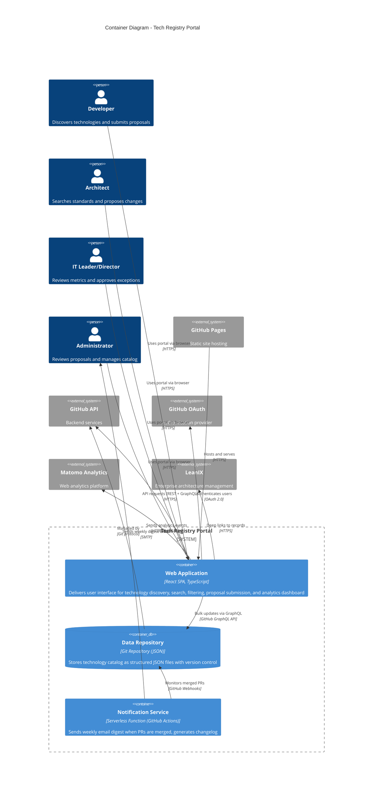

# System Container: Tech Registry Portal

> **System**: Tech Registry Portal
>
> **Purpose**: A web-based technology governance platform enabling IT organizations to discover, understand, and collaboratively manage technology standards through transparent classification, lifecycle management, and community-driven proposals.
>
> **Owner**: Technology Governance Team
>
> **Last Updated**: 2026-01-26

## Overview

This document describes the internal container architecture of the Tech Registry Portal, showing the high-level technical building blocks and how they interact.

The Tech Registry Portal employs a **simplified architecture** with only two containers within the system boundary: a Single-Page Application (SPA) for the user interface and a Git-based Data Repository for persistence. This JAMstack architecture leverages external GitHub services for backend functionality, eliminating the need for custom API servers, databases, or middleware within the system.

**Audience**: Software architects, developers, operations/support staff.

## Container Diagram



## Containers

### Applications & Services

| Container | Technology | Responsibility |
|-----------|------------|----------------|
| **Web Application (SPA)** | Vue.js 3, TypeScript, Vite, Pinia, VueQuery | Delivers responsive user interface for technology discovery, search with filters, proposal submission workflow, analytics dashboard, and administration panels. Runs entirely in the user's browser. |
| **Notification Service** | GitHub Actions (serverless), Node.js | Monitors repository for merged PRs, sends weekly email digest to subscribed users if changes occurred, generates changelog for in-portal display. |

### Data Stores

| Container | Technology | Responsibility | Data Stored |
|-----------|------------|----------------|-------------|
| **Data Repository** | Git Repository, JSON files, GitHub-hosted | Stores technology catalog as structured JSON files with version control, audit trail via Git history, proposals as Pull Requests | Technology records (name, status, lifecycle, classifications), exceptions, revalidation metadata, version history |

## Container Details

### Web Application (SPA)

**Type**: Single-Page Application (Client-Side)

**Technology Stack**:
- **Language**: TypeScript 5.x
- **Framework**: Vue.js 3 with Composition API and TypeScript
- **Build Tool**: Vite (fast development and optimized production builds)
- **State Management**: Pinia for UI state, VueQuery for server state management with caching
- **Routing**: Vue Router v4
- **UI Components**: Tailwind CSS for styling, Headless UI Vue or PrimeVue for accessible components
- **Data Fetching**: Octokit (GitHub REST + GraphQL API client)
- **Schema Validation**: Ajv (JSON Schema validator) for runtime validation of technology records
- **Type Generation**: json-schema-to-typescript for compile-time TypeScript types from JSON Schema
- **Authentication**: GitHub OAuth with PKCE flow, tokens stored in Pinia store (memory only)
- **Security**: Strict Content Security Policy (CSP), short-lived tokens, XSS protection
- **Analytics**: Matomo JavaScript tracker + GitHub API traffic stats
- **Search**: Paginated search with GitHub API, client-side filtering for loaded data

**Responsibility**:

The Web Application is the complete user-facing interface of the Tech Registry Portal. It provides:

1. **Technology Discovery & Search**: Paginated technology browsing with filters by classification (greenbook/blackbook), lifecycle stage, category, and ownership. Full-text search via GitHub API. Lazy loads technology details on demand. Presents technology details with lifecycle indicators, approval dates, exception information, and changelog.

2. **Proposal Management (Portal-Mediated)**: Users submit proposals through web forms in the portal (not directly in GitHub). SPA validates input, creates Pull Requests automatically via GitHub API on behalf of users. Displays proposal status and allows administrators to review proposals in business-friendly format (not raw Git diffs). Approval actions trigger PR merge via GitHub API.

3. **Administration Interface**: Provides administrators with dashboards for reviewing pending proposals (with diff visualization), performing bulk operations via GitHub GraphQL API (multi-file commits), viewing technologies requiring revalidation (linked to GitHub Issues), and creating exception records.

4. **Analytics Dashboard**: Displays adoption metrics from Matomo (page views, searches, engagement) combined with GitHub API stats (unique contributors, PR activity) for hybrid measurement approach.

5. **Authentication & Authorization**: Integrates GitHub OAuth with PKCE flow to authenticate users. OAuth tokens stored in Pinia store (memory only, cleared on page refresh) for security. Retrieves user permissions from GitHub repository access to conditionally display admin features.

6. **JSON Schema Validation**: All technology records are validated against JSON Schema specifications before display and before submission. Ensures type safety, data consistency, and technical validity. Generates TypeScript types from schemas for compile-time type checking.

The SPA fetches technology catalog data from the Data Repository via GitHub API, renders all UI client-side, and requires no server-side rendering or custom backend API.

**Scaling Notes**:
- Horizontal scaling handled by GitHub Pages CDN (global content distribution)
- Client-side rendering shifts compute load to user browsers (no server scaling needed)
- GitHub API rate limits (5000 requests/hour for authenticated users) constrain concurrent usage
- Pagination and lazy loading implemented from Day 1 to support catalog growth beyond 3,000 technologies
- Token stored in Pinia store (memory only) requires re-authentication on page refresh (acceptable trade-off for security)
- JSON Schema validation adds minimal overhead (~1ms per record validation)
- Consider service worker for offline caching of catalog data (future enhancement)

---

### Data Repository

**Type**: Git Repository (Data Store)

**Technology Stack**:
- **Storage**: Git repository hosted on GitHub
- **Data Format**: JSON files following defined schemas (technology.v1.schema.json, etc.)
- **Version Control**: Git for complete history and audit trail
- **Access**: GitHub API (REST and GraphQL)

**Responsibility**:

The Data Repository stores the complete technology catalog as structured JSON files in a Git repository. It serves as:

1. **Technology Catalog Storage**: Each technology is represented as a JSON file following the technology.v1.schema.json format with fields for name, status, lifecycle, classifications, descriptions, capabilities, versions, and exceptions.

2. **Version Control & Audit Trail**: Git commit history provides immutable record of all changes with author, timestamp, and commit message explaining the change rationale. Every update to the catalog is versioned.

3. **Proposal Workflow Backend**: Pull Requests serve as the proposal mechanism. The portal creates PRs automatically when users submit proposals through web forms. Administrators review proposals in the portal (business-friendly format). Merging a PR = approving the proposal and updating the catalog atomically.

4. **Revalidation Workflow Tracking**: Technology JSON files contain simple flag (`requiresRevalidation: true`) to indicate revalidation needed. Detailed workflow tracking (assignee, status, progress, outcome) managed through GitHub Issues. Leverages GitHub's issue features (labels, milestones, notifications, assignments).

5. **Access Control**: GitHub repository permissions enforce authorization. Read access allows viewing catalog, write access allows creating PRs (proposals via portal), and merge access allows approving proposals (admins/directors only).

The repository structure organizes technologies by category or lifecycle stage, making it easy to browse and manage at scale. All technology records conform to JSON Schema specifications (technology.v1.schema.json) stored in the repository. Schema validation enforces data quality, type safety, and consistency. TypeScript types are automatically generated from schemas for compile-time validation in the SPA.

**Scaling Notes**:
- Git repositories scale to tens of thousands of files efficiently
- For very large catalogs (10,000+ technologies), consider sharding into multiple repositories by category
- Repository size and clone performance remain manageable with structured JSON (text files, not binary)
- GitHub API pagination handles large result sets transparently

---

### Notification Service

**Type**: Serverless Function (GitHub Actions Workflow)

**Technology Stack**:
- **Runtime**: Node.js 20 (GitHub Actions runner)
- **Trigger**: GitHub webhook on PR merge events
- **Email Service**: SMTP integration (SendGrid, Mailgun, or organization email server)
- **Scheduling**: GitHub Actions scheduled workflow (weekly cron job)

**Responsibility**:

The Notification Service provides proactive communication about technology governance changes through two mechanisms:

1. **Weekly Email Digest**: Runs as scheduled GitHub Action every week (e.g., Friday morning). Checks if any PRs were merged in the past week. If changes occurred, generates digest email summarizing new technologies, updated classifications, lifecycle transitions, and exception changes. Sends email to subscribed users (subscription list maintained in repository configuration file).

2. **Changelog Generation**: On each PR merge, updates a changelog file in the repository with structured change information. The SPA displays this changelog on the portal landing page, providing on-demand access to recent changes.

The service is triggered by GitHub webhooks when PRs are merged to the main branch, ensuring timely changelog updates. Weekly digest prevents email spam while keeping users informed.

**Scaling Notes**:
- Stateless serverless function, scales automatically with GitHub Actions
- Email sending rate limited by email service provider (typically thousands/hour)
- For large organizations (500+ subscribers), consider batch sending
- Changelog file size grows over time; implement archival after 1 year

---

## Communication Patterns

### Synchronous Communication

| From | To | Protocol | Purpose |
|------|-----|----------|---------|
| **Web Application** | **Data Repository** | HTTPS/REST (GitHub API) | Paginated fetch of technology catalog, search via GitHub API, fetch commit history for changelog |
| **Web Application** | **Data Repository** | HTTPS/GraphQL (GitHub API) | Create proposals as PRs (portal-mediated), bulk updates via multi-file commits, fetch GitHub Issues for revalidation tracking |
| **Web Application** | **GitHub OAuth** | OAuth 2.0 / HTTPS | Authenticate users with PKCE flow, retrieve user identity and repository permissions for authorization |
| **Web Application** | **Matomo Analytics** | HTTPS / JavaScript API | Send page view events, user interactions, search queries for adoption tracking |
| **Web Application** | **GitHub API** | HTTPS/REST | Fetch traffic stats for hybrid analytics (unique contributors, PR activity) |
| **Web Application** | **LeanIX** | HTTPS (deep links) | Navigate to LeanIX technology records for comprehensive enterprise architecture context |
| **Notification Service** | **Data Repository** | GitHub Webhooks | Triggered on PR merge events, monitors repository for changes |
| **Notification Service** | **Email Service** | SMTP / HTTPS | Sends weekly digest email to subscribed users if PRs were merged |
| **GitHub Pages** | **Web Application** | HTTPS | Serve static site assets (HTML, CSS, JavaScript bundles) to user browsers |

### Asynchronous Communication

None. The architecture is entirely synchronous with request-response patterns. All interactions are user-initiated via the browser.

## Entry Points

| Actor | Entry Container | Protocol | Purpose |
|-------|-----------------|----------|---------|
| **Developer** | Web Application (SPA) | HTTPS via browser | Discover approved technologies, view technology details, submit proposals for new technologies |
| **Architect** | Web Application (SPA) | HTTPS via browser | Search technology standards, filter by lifecycle and classification, propose changes to records |
| **IT Leader/Director** | Web Application (SPA) | HTTPS via browser | Review adoption metrics dashboard, approve exception requests, fast-track urgent proposals |
| **Administrator** | Web Application (SPA) | HTTPS via browser | Review pending proposals (PRs), perform bulk updates, manage revalidation workflows, approve proposals |

**Note**: All users access the same Web Application container. Role-based features are conditionally displayed based on GitHub repository permissions retrieved after authentication.

## Integration Points

| External System | Container | Direction | Protocol | Purpose |
|-----------------|-----------|-----------|----------|---------|
| **GitHub Pages** | Web Application | Inbound | HTTPS | Host and serve static site assets to user browsers with global CDN |
| **GitHub API (REST + GraphQL)** | Web Application | Outbound | HTTPS/REST, GraphQL, OAuth 2.0 | Paginated read of technology catalog, search, create PRs (portal-mediated proposals), bulk updates via GraphQL multi-file commits, fetch GitHub Issues for revalidation, fetch traffic stats for analytics |
| **GitHub OAuth** | Web Application | Outbound | OAuth 2.0 / HTTPS | Authenticate users with PKCE flow (tokens in memory only), retrieve user profile and repository permissions for authorization |
| **Matomo Analytics** | Web Application | Outbound | HTTPS / JavaScript tracker | Send analytics events (page views, interactions, searches) for adoption tracking (hybrid with GitHub stats) |
| **LeanIX** | Web Application | Outbound | HTTPS (deep links only) | Provide navigation links to LeanIX technology records for users seeking comprehensive enterprise architecture context |
| **GitHub Webhooks** | Notification Service | Inbound | HTTPS | Trigger notification service on PR merge events for changelog updates |
| **Email Service (SMTP)** | Notification Service | Outbound | SMTP / HTTPS | Send weekly email digest to subscribed users when changes occurred |

## Technology Decisions

| Decision | Choice | Rationale |
|----------|--------|-----------|
| **Frontend Framework** | Vue.js 3 with TypeScript | Progressive framework with excellent TypeScript support, Composition API provides type-safe reactive programming, smaller bundle size than React, excellent developer experience |
| **Build Tool** | Vite | Fast development server with hot module replacement, optimized production builds, created by Vue.js author (Evan You), first-class Vue support |
| **State Management** | Pinia for UI state, VueQuery for server state | Pinia is official Vue state management with full TypeScript support, VueQuery handles server state with caching and invalidation (Vue port of TanStack Query) |
| **Schema Validation** | Ajv + json-schema-to-typescript | Runtime validation with Ajv (fastest JSON Schema validator), compile-time types from json-schema-to-typescript, ensures data quality at both runtime and development time |
| **Data Storage** | Git Repository (JSON files) | Eliminates need for custom database, provides version control and audit trail built-in, familiar to technical audience, cost-efficient |
| **Backend Architecture** | GitHub API as backend (REST + GraphQL) | Leverages existing GitHub infrastructure, GraphQL for bulk operations, no server/database/API to maintain, reduces operational complexity and cost |
| **Proposal Workflow** | Portal-mediated PR creation | Users submit via web forms (not direct GitHub PRs), SPA creates PRs automatically, lowers barrier for non-technical users, provides controlled UX |
| **Bulk Operations** | GitHub GraphQL API | GraphQL `createCommitOnBranch` mutation enables multi-file commits from client, clean Git history, no additional backend infrastructure |
| **Authentication** | GitHub OAuth with PKCE | Seamless integration with GitHub API, repository permissions map directly to portal roles, familiar flow for technical users |
| **Token Storage** | Pinia store (memory only) + CSP | Defense in depth: tokens in Pinia store memory (cleared on refresh), strict CSP, short-lived tokens, regular security audits, XSS mitigation |
| **Search Architecture** | Paginated search via GitHub API | Lazy loading and pagination from Day 1, scales beyond 3,000 technologies, faster initial load, client-side filtering for loaded data |
| **Revalidation Tracking** | Hybrid: JSON flags + GitHub Issues | Technology JSON has simple flag, detailed workflow in GitHub Issues (assignees, status, progress), leverages GitHub issue tracking features |
| **Notifications** | Serverless (GitHub Actions) + In-Portal | Weekly email digest if changes occurred (GitHub Actions scheduled workflow), in-portal changelog on landing page, hybrid push/pull communication |
| **Hosting** | GitHub Pages | Free static site hosting with global CDN, integrates seamlessly with GitHub repository workflow, reliable and performant |
| **Analytics** | Hybrid: Matomo + GitHub API Stats | Matomo for general analytics (page views, searches, engagement), GitHub API for traffic stats (unique contributors, PR activity), multiple data sources increase confidence |

## Architectural Patterns

### JAMstack Architecture

The Tech Registry Portal follows the **JAMstack** (JavaScript, APIs, Markup) architectural pattern:

- **JavaScript**: Vue.js SPA runs in the browser, handles all UI rendering and business logic
- **APIs**: External APIs (GitHub API, Matomo) provide backend functionality
- **Markup**: Pre-built HTML/JavaScript bundles served statically from GitHub Pages CDN

**Benefits**:
- **Performance**: Pre-built assets served from global CDN, no server-side rendering latency
- **Security**: Reduced attack surface with no custom backend servers or databases to compromise
- **Scalability**: Static assets scale effortlessly via CDN, no server capacity planning
- **Cost**: Minimal infrastructure costs (GitHub Pages free for public repos, minimal for private)
- **Developer Experience**: Simple deployment (push to Git, automatic rebuild and deploy)

### Git as Database

The portal treats the **Git repository as the database**:

- **CRUD Operations**: Create (new files), Read (fetch files), Update (modify files), Delete (remove files) via Git commits
- **Transactions**: Git commits are atomic - all-or-nothing changes
- **Schema**: JSON Schema validation ensures data integrity
- **Indexes**: Git tree structure and file naming conventions enable efficient lookups
- **Queries**: GitHub API provides search and filtering capabilities

**Trade-offs**:
- Not suitable for high-write-frequency use cases (Git commits have overhead)
- Complex queries require client-side filtering (acceptable for portal's use case)
- GitHub API rate limits constrain maximum concurrent users (5000 requests/hour per user)

### Proposal-as-Pull-Request Pattern

Technology proposals map directly to **GitHub Pull Requests**:

- **Proposal Creation**: User creates PR with changes to technology JSON files
- **Review Workflow**: Administrators review PR, request changes via comments, discuss with submitter
- **Approval**: Merging PR = approving proposal and updating catalog atomically
- **Rejection**: Closing PR = rejecting proposal with rationale in comments
- **Audit**: PR history and commit messages provide complete audit trail

**Benefits**:
- Familiar workflow for technical users (IT professionals already use GitHub)
- Built-in review and discussion capabilities
- No custom workflow engine to build or maintain
- Strong audit trail with immutable history

### JSON Schema Validation Pattern

All technology records conform to **JSON Schema specifications** for type safety and data consistency:

- **Schema Definitions**: JSON Schema files stored in repository (`/schemas/technology.v1.schema.json`) define structure, types, required fields, validation rules
- **Runtime Validation**: Ajv validator checks records on load and before submission (client-side and CI/CD)
- **Compile-Time Types**: json-schema-to-typescript generates TypeScript interfaces from schemas automatically
- **Type Safety**: Vue components receive strongly-typed data, TypeScript compiler catches type mismatches
- **CI/CD Validation**: GitHub Actions workflow validates all technology JSON files against schema on every PR
- **Schema Evolution**: Versioned schemas (v1, v2, etc.) enable backward-compatible changes

**Validation Flow**:
```
1. Developer edits technology JSON file
2. CI/CD validates JSON against schema (block merge if invalid)
3. SPA fetches technology data from repository
4. Ajv validator validates data at runtime (before rendering)
5. TypeScript ensures components use data correctly (compile-time)
```

**Benefits**:
- **Type Safety**: Catches errors at development time and runtime
- **Data Quality**: Prevents malformed records from entering catalog
- **Documentation**: Schema serves as machine-readable API documentation
- **Tooling**: Enables IDE autocomplete, validation, and error checking
- **Consistency**: All records follow same structure and validation rules

**Trade-offs**:
- Schema changes require careful versioning and migration planning
- Validation adds minimal runtime overhead (~1ms per record)
- Developers must understand JSON Schema syntax for schema modifications

## Architectural Decisions & Gap Resolutions

During architecture design, several critical gaps were identified and addressed through the following decisions:

### 1. Proposal User Experience (Gap Resolution)

**Decision**: Portal-mediated PR creation instead of requiring users to create PRs directly in GitHub.

**Rationale**: While developers are comfortable with GitHub PRs, architects and especially IT leaders/directors may find the GitHub UI intimidating for governance decisions. By providing web forms in the portal that automatically create PRs, we lower the barrier for broader adoption while maintaining the benefits of GitHub's PR workflow backend.

**Implementation**: SPA provides proposal forms with JSON Schema validation, creates PRs via GitHub API on behalf of users, displays proposals in business-friendly format (not raw Git diffs), enables approval actions that trigger PR merges. All submitted data validated against schema before PR creation.

### 2. Notification Mechanism (Gap Resolution)

**Decision**: Hybrid notification system with serverless email digest + in-portal changelog.

**Rationale**: The PRD targets 30% adoption at 1 year, which requires proactive communication about technology changes. Without notifications, users must remember to check the portal, risking low adoption. The hybrid approach balances push (email) and pull (portal) communication.

**Implementation**: GitHub Actions workflow triggered weekly, sends digest email if PRs merged that week, generates structured changelog file displayed on portal landing page.

### 3. Bulk Operations Implementation (Gap Resolution)

**Decision**: Use GitHub GraphQL API `createCommitOnBranch` mutation for multi-file commits.

**Rationale**: GitHub REST API only supports single-file commits, which would create cluttered Git history for bulk operations. GraphQL enables multi-file commits from client-side code without additional backend infrastructure.

**Implementation**: SPA uses Octokit GraphQL client to create multi-file commits for bulk updates (e.g., marking 50 technologies as requiring revalidation in one commit).

### 4. OAuth Token Security (Gap Resolution)

**Decision**: Defense in depth approach - tokens in Pinia store (memory only) + strict CSP + short-lived tokens.

**Rationale**: Governance system requires strong security. Tokens in localStorage are vulnerable to XSS. Backend proxy would require infrastructure. Memory-only storage with multiple security layers provides acceptable balance.

**Implementation**: OAuth tokens stored in Pinia store (cleared on page refresh), strict Content Security Policy enforced, regular security audits, dependency scanning, JSON Schema validation prevents malformed data injection, token refresh on expiration.

### 5. Search Scalability (Gap Resolution)

**Decision**: Pagination and lazy loading from Day 1, search via GitHub API.

**Rationale**: While initial estimate is "hundreds to low thousands" of technologies, organizational scope could expand. Pagination future-proofs the architecture and improves initial load performance regardless of catalog size.

**Implementation**: Fetch technologies paginated by category/lifecycle, search queries use GitHub API filtering, lazy load technology details on demand, client-side filtering for loaded data.

### 6. Revalidation Workflow State (Gap Resolution)

**Decision**: Hybrid approach - simple flag in technology JSON + detailed workflow in GitHub Issues.

**Rationale**: Revalidation requires workflow tracking (assignee, status, progress, deadline) but mixing this with master data clutters technology records. GitHub Issues provide built-in workflow features (assignments, labels, milestones, notifications).

**Implementation**: Technology JSON has `requiresRevalidation: true` flag, GitHub Issue created for each revalidation work item with assignee and tracking, portal displays Issues linked to technologies requiring revalidation.

### 7. Exception Data Model (Gap Resolution)

**Decision**: TO BE DETERMINED - currently considering separate exception files with references from technology records.

**Rationale**: Exceptions are significant governance decisions requiring detailed tracking (rationale, scope, expiration, approver, restrictions). The data model requires further design to balance query simplicity with separation of concerns.

**Status**: Architectural decision deferred, requires stakeholder input on exception management patterns and reporting requirements.

### 8. Analytics Accuracy (Gap Resolution)

**Decision**: Hybrid analytics - Matomo for general tracking + GitHub API stats for engaged users.

**Rationale**: Ad blockers may block Matomo tracking, VPN may affect IP-based user counting. Multiple data sources increase confidence in adoption metrics. GitHub API provides authentic contributor data.

**Implementation**: Matomo JavaScript tracker for page views/interactions, GitHub API `/repos/{owner}/{repo}/traffic` endpoint for unique contributors/clones, cross-validate metrics from both sources.

## Constraints & Considerations

### GitHub API Rate Limits

- **Authenticated Requests**: 5000 requests per hour per user
- **Implication**: Approximately 1.4 requests per second sustained, sufficient for expected concurrency (2-3 concurrent users)
- **Mitigation**: Implement client-side caching with VueQuery, cache technology catalog data with 5-minute TTL, lazy load data as needed

### Repository Size

- **Current Estimate**: Hundreds to low thousands of technology records
- **Average File Size**: ~2-5 KB per technology JSON file
- **Total Repository Size**: <10 MB for 1000 technologies
- **Constraint**: Git performs well up to 100,000 files and gigabyte-scale repositories
- **Conclusion**: No scaling concerns for foreseeable future

### Browser Compatibility

- **Target**: Modern evergreen browsers (Chrome, Firefox, Safari, Edge)
- **Minimum**: Browsers supporting ES2020, async/await, Fetch API
- **Consideration**: IT professionals typically use up-to-date browsers
- **Polyfills**: Minimal or none required

### OAuth Token Persistence

- **Current**: Tokens stored in Pinia store (memory only)
- **Implication**: Page refresh requires re-authentication via GitHub OAuth
- **User Impact**: Users must re-authenticate if they refresh the page or close/reopen the browser
- **Mitigation**: VueQuery caching reduces data fetching after re-auth, OAuth flow is quick (1-2 clicks)
- **Trade-off**: Security (XSS protection) prioritized over convenience

### Offline Functionality

- **Current**: None (requires GitHub API connectivity)
- **Potential Enhancement**: Service Worker to cache technology catalog for offline browsing
- **Trade-off**: Read-only offline access acceptable, write operations (proposals) require connectivity

## Related Documentation

- System Context: `./system-context.md`
- System Landscape: `./system-landscape.md`
- Component Diagrams: `./components/` (to be created for Web Application internal structure)
- Deployment Diagram: `./system-deployment.md` (to be created)
- Product Requirements: `../product/product-requirement.md`
- Data Schemas: `../research/schema/`
