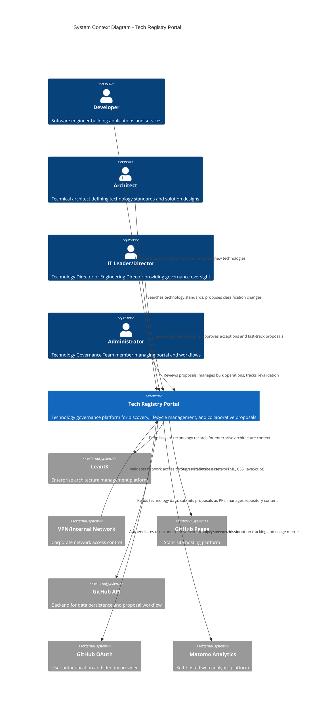

# System Context: Tech Registry Portal

> **Purpose**: A web-based technology governance platform enabling IT organizations to discover, understand, and collaboratively manage technology standards through transparent classification, lifecycle management, and community-driven proposals.
>
> **Owner**: Technology Governance Team
>
> **Last Updated**: 2026-01-26

## System Overview

The Tech Registry Portal serves as the single source of truth for organizational technology standards and governance decisions. It transforms technology governance from a top-down mandate into a collaborative, transparent process where every IT professional can quickly discover approved technologies (greenbook) and prohibited technologies (blackbook), understand technology lifecycle stages, and actively participate in technology decisions through community proposals.

The portal addresses the critical gap in technology governance visibility that exists in enterprise architecture tools like LeanIX. While LeanIX provides comprehensive enterprise architecture management, the Tech Registry Portal focuses on making technology governance accessible, collaborative, and transparent for day-to-day technology decisions. It empowers developers and architects with the information they need while providing administrators and directors with efficient governance workflows, bulk operations, and exception management capabilities.

The system operates as a lightweight, static web application hosted on GitHub Pages, secured through VPN and internal network access. It supports the organization's technology governance framework by tracking technology classifications, managing lifecycle transitions with impact-based grace periods (30/90/180+ days), enabling community-driven proposal workflows with standard (2-week) and fast-track approval paths, and providing visibility into exceptions that allow flexibility within strict central standards.

## Context Diagram

## People / Actors

| Actor | Description | Interactions |
|-------|-------------|--------------|
| **Developer** | Software engineers and developers building applications and services across local and central entities (weekly interaction) | Discovers approved technologies for new projects, understands technology restrictions before architectural decisions, proposes new technologies when current options don't meet needs |
| **Architect** | Technical and solution architects defining technology standards and designing solutions (weekly interaction) | Defines technology standards for project architectures, understands technology relationships and compatibility, identifies obsolete technologies requiring replacement, proposes changes to technology classifications based on field experience |
| **IT Leader/Director** | Technology Director or Engineering Director providing strategic governance oversight (monthly/quarterly interaction) | Reviews technology landscape and governance compliance, approves/rejects exception requests, fast-tracks urgent proposals, manages technology lifecycle transitions, tracks adoption metrics and standardization progress |
| **Administrator** | Technology Governance Team members managing the portal and governance workflows (daily interaction) | Reviews and approves/rejects community proposals, performs bulk operations on technology records, manages revalidation workflows for expiring technologies, creates and tracks exception records, assigns proposals to subject matter experts when specialized expertise needed |

## External Systems

### Internal Dependencies

| System | Owner | Data/Services Consumed | Data/Services Provided |
|--------|-------|------------------------|------------------------|
| **LeanIX** | Enterprise Architecture Team | Deep link URLs to technology records for comprehensive enterprise architecture context and relationships | None (read-only reference, no data synchronization) |
| **VPN/Internal Network** | IT Infrastructure/Security Team | Network-level access control ensuring only authorized organization members can reach the portal (first security layer) | None (network boundary only) |
| **Matomo Analytics** | IT Operations/Analytics Team | Self-hosted analytics platform for tracking user adoption, page views, search queries, and engagement metrics | Analytics events (page views, user interactions, search queries) from the portal |

### External Dependencies (Third-Party)

| System | Vendor | Data/Services Consumed | Data/Services Provided |
|--------|--------|------------------------|------------------------|
| **GitHub Pages** | GitHub (Microsoft) | Static site hosting, HTTPS delivery, global CDN content distribution | Static HTML/CSS/JavaScript files for portal frontend |
| **GitHub API** | GitHub (Microsoft) | Backend data storage via Git repository (technology catalog as JSON files), proposal workflow via Pull Requests, repository content management (read/write operations), commit history as audit trail | Technology data updates, proposal submissions as PRs, approval decisions via PR merges |
| **GitHub OAuth** | GitHub (Microsoft) | User authentication and identity verification, user profile information, GitHub username and email, repository permissions for authorization (who can merge PRs = who can approve proposals) | User credentials, OAuth tokens for authenticated API requests |

## Key Interactions

| From | To | Description | Frequency |
|------|-----|-------------|-----------|
| Developer | Tech Registry Portal | Searches for approved technologies, views technology details, authenticates via GitHub, submits proposals for new technologies as Pull Requests | Weekly |
| Architect | Tech Registry Portal | Browses technology catalog, filters by lifecycle stage and classification, proposes changes to existing technology records via Pull Requests | Weekly |
| IT Leader/Director | Tech Registry Portal | Reviews pending proposals (PRs), approves/rejects proposals by merging or closing PRs, approves exception requests, monitors adoption metrics dashboard | Monthly/Quarterly |
| Administrator | Tech Registry Portal | Reviews and processes community proposals (PRs), performs bulk updates on technology JSON files, merges approved PRs, tracks revalidation workflows, manages exceptions via direct commits | Daily |
| Tech Registry Portal | LeanIX | Provides deep links from technology records to LeanIX for users seeking comprehensive enterprise architecture context | On-demand (when user clicks link) |
| VPN/Internal Network | Tech Registry Portal | Validates user is on corporate network before allowing any portal access (first security layer) | Every portal access attempt |
| Tech Registry Portal | GitHub Pages | Loads static site assets (HTML, CSS, JavaScript) to render the portal interface | Every page load |
| Tech Registry Portal | GitHub API | Reads technology catalog (JSON files from repo), submits new proposals (creates Pull Requests), retrieves proposal status, fetches commit history for audit trail, performs bulk updates via commits | Continuous during user sessions |
| Tech Registry Portal | GitHub OAuth | Authenticates users when they want to submit proposals or access admin features, retrieves user identity and permissions | On login and when authentication required |
| Tech Registry Portal | Matomo Analytics | Sends page view events, user interaction events, search queries, and engagement metrics for adoption tracking | Every user interaction |

## Boundaries & Scope

**In Scope**:
- Technology discovery and search (full-text search, filtering by classification/lifecycle/category)
- Technology lifecycle management (tracking stages from proposed through active, deprecating, deprecated, to prohibited)
- Community-driven proposal and change management workflows via GitHub Pull Requests
- Governance approval workflows via PR reviews and merges (standard 2-week cycle and fast-track paths)
- Bulk operations for administrative efficiency via direct commits to technology data files
- Exception management with director-level approval (tracked in technology records)
- Web analytics and adoption tracking via self-hosted Matomo
- Static site architecture (JAMstack approach) with GitHub as backend for data persistence
- User authentication via GitHub OAuth
- Authorization via GitHub repository permissions (write/merge access = admin capabilities)
- Audit trail via Git commit history
- Deep linking to external systems (LeanIX) for reference

**Out of Scope**:
- Live bidirectional integration with LeanIX (data remains independent)
- Custom user management system (delegated to GitHub OAuth and repository permissions)
- Email notifications and multi-channel communication (future enhancement)
- Real-time collaboration features beyond GitHub PR comments
- Technology usage tracking across applications (remains in LeanIX domain)
- Automated technology discovery from code repositories or CI/CD pipelines
- Mobile native applications (responsive web only)
- Custom database or backend API services (GitHub API serves this role)

## Architectural Approach: GitHub as Backend

The Tech Registry Portal leverages **GitHub as the backend infrastructure** rather than building a custom API and database. This architectural pattern provides several advantages for a technology governance portal:

### Data Storage via Git Repository
- **Technology Catalog**: Stored as structured JSON files in a Git repository
- **Version Control**: Every change to technology data is tracked with full Git commit history
- **Audit Trail**: Git history serves as immutable record of who changed what, when, and why
- **Transparency**: Repository structure and data formats are visible to all authorized users

### Proposal Workflow via Pull Requests
- **Community Proposals**: Users submit proposals by creating Pull Requests that modify technology JSON files
- **Review Process**: Administrators review PRs, request changes via comments, discuss with submitters
- **Approval**: Merging a PR = approving the proposal and updating the catalog atomically
- **Rejection**: Closing a PR = rejecting the proposal with rationale in comments
- **Iteration**: PRs support back-and-forth refinement before approval

### Authorization via Repository Permissions
- **Read Access**: All authenticated users can view the portal and browse the catalog
- **Write Access**: Users with repository write permissions can create Pull Requests (proposals)
- **Merge Access**: Administrators and Directors with merge permissions can approve proposals
- **Role Mapping**: GitHub teams and repository permissions enforce governance roles

### Benefits of This Approach
- **No Custom Backend**: Eliminates need for custom API development, database management, and server infrastructure
- **Built-in Collaboration**: GitHub PR workflow provides familiar interface for technical users
- **Strong Audit Trail**: Git commit history provides governance-grade audit capabilities
- **Cost Efficiency**: Leverages existing GitHub infrastructure without additional hosting costs
- **Developer-Friendly**: IT professionals already use GitHub daily, reducing onboarding friction
- **Offline Editing**: Administrators can edit technology files locally with full Git workflow

### Trade-offs
- **Technical Barrier**: Non-technical users may find PR workflow less intuitive than web forms
- **GitHub Dependency**: Portal functionality depends on GitHub API availability
- **Permission Model Constraint**: Authorization model tied to GitHub repository structure
- **Limited Custom Workflows**: Approval workflows constrained by GitHub PR capabilities

## Related Documentation

- System Landscape: `./system-landscape.md`
- Container Diagram: `./system-container.md` (to be created)
- Component Diagrams: `./components/` (to be created)
- Deployment Diagram: `./system-deployment.md` (to be created)
- Product Requirements: `../product/product-requirement.md`
